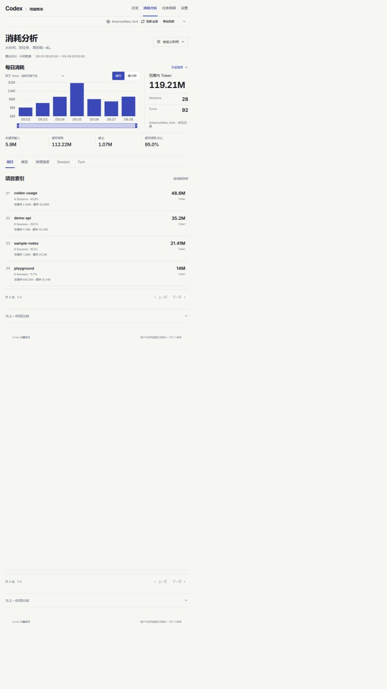

# Codex Usage

**See where your Codex tokens go.**

A local dashboard for understanding your Codex activity. Follow a usage spike from a project to a task and down to an individual turn. See how much work came from the main agent and its subagents—or ask your agent to look up the numbers for you.

[Explore the live example](https://codex-usage-showcase.sorenliu.workers.dev) · [Get started](#get-started) · [User guide](docs/USER_GUIDE.md) · [简体中文](README.zh-CN.md)

Windows x64 · Local-first · Apache-2.0

Try the [interactive product showcase](https://codex-usage-showcase.sorenliu.workers.dev) with synthetic data before installing. Your own usage is available in the local app.



*A week of activity across four example projects. Screenshots use synthetic data in the real application; the current UI is in Chinese.*

## Follow the numbers to the work

### From a busy day to a single turn

Start with the daily trend, open a day to see its hours, and narrow the view by project, model, or reasoning effort. Move into a task to inspect its turns, or browse turns across tasks to find the largest ones. Your filters stay with you as you explore.

### See the whole agent team

A task can delegate work, and those subagents can delegate again. View **the current agent, all subagents, and the team total** separately, then open any agent to inspect its turns. Each row shows that agent's own usage, so a busy child does not disappear inside its parent's number.


*One example task: 18.2M tokens from the current agent, 30.4M from its descendants, and 48.6M for the team. Chinese UI; synthetic data.*

### Understand what changed

Compare periods to find which projects, models, or tasks account for an increase. Separate uncached input, cache reads, and output to understand the composition of that usage. Optional API reference costs add another perspective when you need it.

### Ask your agent

Install the included Skill and use the same data from a conversation:

> Which tasks used the most tokens over the last seven days?
>
> How many tokens did this task's subagents use?
>
> Which tasks have a low cache-hit share?

The Skill queries the local service through the CLI. Its answers retain the time range, source, and missing-data caveats, so you can check what a number represents.

## Get started

**Let your agent install it.** Give it this prompt:

> Install Codex Usage using https://github.com/Cusnd/codex-usage/blob/main/docs/INSTALL_FOR_AGENTS.md, install its Skill, and show me how to open the dashboard.

The [installation guide](docs/INSTALL_FOR_AGENTS.md) covers verified downloads and a user-level Node setup when needed.

**Already have Node.js 26.7.0 or newer on Windows x64?** Download the `.tgz` and `SHA256SUMS` from [Releases](https://github.com/Cusnd/codex-usage/releases/latest), verify the package as described in the [manual installation guide](docs/USER_GUIDE.md#manual-installation), then install it:

```powershell
npm install --global --ignore-scripts .\codex-detailed-usage-0.1.1.tgz
codex-usage
```

This example uses v0.1.1; use the filename of the release you downloaded. The release includes the built web app. Install **`codex-detailed-usage` from this project's release**, as the npm package named `codex-usage` belongs to another project.

To enable agent queries:

```powershell
codex-usage skill install
```

Open a fresh agent task if the newly installed Skill is not discovered yet. First-time history import may take a few minutes; the app shows progress.

## Your data, in context

- **Local history stays local.** The app reads your Codex records without modifying them and does not upload usage history. Its cache contains usage metadata, including task titles and project paths, rather than chat bodies or tool output.
- **Account limits are a separate view.** Available account features use your existing Codex login. Local token activity and account-level snapshots cover different things and are not added together.
- **Reference costs are estimates.** Optional API pricing does not represent your ChatGPT subscription bill. Incomplete records or unknown prices remain marked as incomplete.
- **Coverage follows your records.** Results reflect recognizable history retained on this computer; they are not a complete multi-device account ledger.

## Explore further

| Looking for… | Start here |
| --- | --- |
| Filters, comparisons, startup, upgrades, and troubleshooting | [User guide](docs/USER_GUIDE.md) |
| A repeatable installation procedure for an agent | [Agent installation guide](docs/INSTALL_FOR_AGENTS.md) |
| CLI/API behavior, counting rules, and data sources | [Technical reference](docs/TECHNICAL_REFERENCE.md) |
| Development and contribution checks | [Contributing](CONTRIBUTING.md) |

Found a problem? [Open an issue](https://github.com/Cusnd/codex-usage/issues) with reproduction steps and sanitized errors.

Licensed under [Apache-2.0](LICENSE). See [third-party notices](THIRD_PARTY_NOTICES.md) for dependencies, fonts, and attribution.
