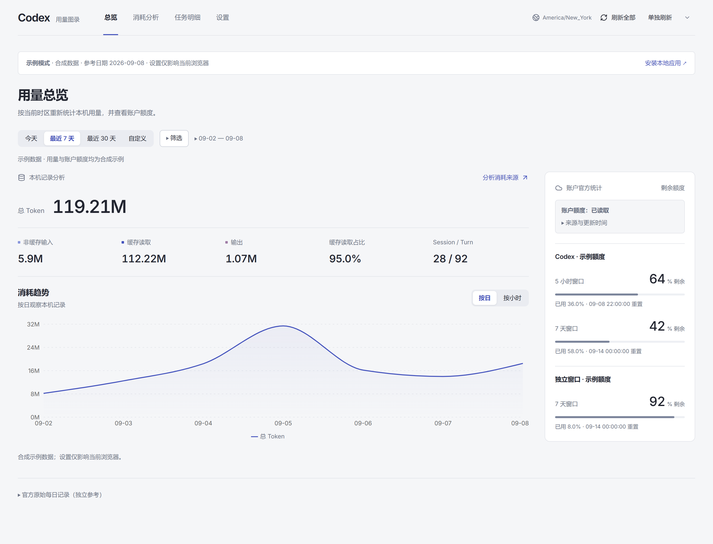
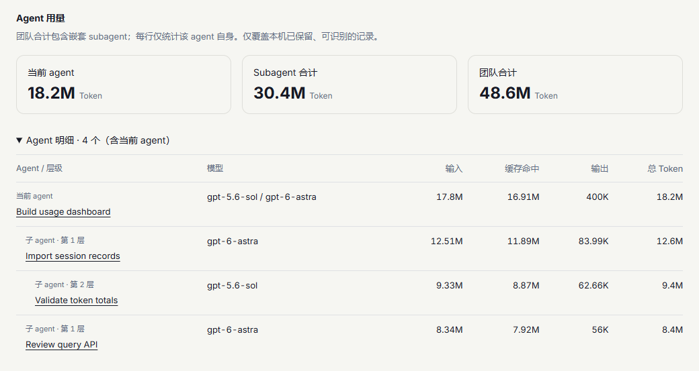

# Codex Usage

**看清 Codex 的用量花在哪里。**

一个在本机运行的 Codex 用量看板。从消耗高峰追到项目、任务，再深入具体轮次；分开查看主 Agent 与子 Agent 的用量，也可以直接让 Agent 帮你查询和分析。

[在线示例](https://codex-usage-showcase.sorenliu.workers.dev) · [开始使用](#开始使用) · [使用指南](docs/USER_GUIDE.zh-CN.md) · [English](README.md)

Windows x64 · macOS Apple Silicon / Intel · 本地优先 · Apache-2.0

当前开发树新增 Linux x64/arm64 与多设备云端面板，尚未发布到 npm。Linux 的安装路径及已验证范围见 [Linux 支持说明](docs/LINUX_COMPATIBILITY.md)，云端实现和验收进度见 [实施记录](docs/design/multi-device-cloud-panel-implementation-progress-2026-09-11.md)。

0.1.3 版本新增 macOS Apple Silicon 和 Intel 支持，并通过两种架构的原生 GitHub Actions 验证，安装和运行记录见 [macOS 兼容说明](docs/MACOS_COMPATIBILITY.md)。0.1.2 及更早版本仅支持 Windows。

安装前可以先体验[在线示例](https://codex-usage-showcase.sorenliu.workers.dev)：与本地应用使用同一套 React 前端，接入合成记录，可操作任务、轮次、Agent 团队、筛选和仅保存在当前浏览器的成本设置。查看自己的真实用量时，请使用本地应用。



*28 个任务、92 个轮次，共 119.21M Token。截图来自在线示例，与本地应用使用同一套前端；用量和账户额度均为合成数据，当前界面为中文。*

## 从数字找到具体工作

### 从消耗高峰，一直看到某一轮

先看每日趋势，选中一天查看小时分布，再按项目、模型或推理强度缩小范围。进入任务查看各轮消耗，也能在跨任务轮次列表中寻找用量最高的一轮。切换视图时，筛选条件会跟随保留。

### 看清整个 Agent 团队

一个任务可以把工作交给子 Agent，子 Agent 也可以继续委派。分别查看**当前 Agent、所有子 Agent 和整个团队的合计**，再进入任意 Agent 查看轮次。每一行只展示该 Agent 自身的用量，方便辨认工作究竟发生在哪里。



*一个示例任务：当前 Agent 消耗 18.2M Token，后代合计 30.4M，团队合计 48.6M。截图为中文界面，数据均为合成示例。*

### 理解用量为什么变化

对比两个时段，定位哪些项目、模型或任务贡献了用量增幅。拆开非缓存输入、缓存读取与输出，查看消耗构成；需要时，还可以开启 API 参考成本估算。

### 直接问你的 Agent

安装配套 Skill 后，可以在对话里查询同一份本地统计：

> 过去七天，哪些任务消耗的 Token 最多？
>
> 这个任务的子 Agent 一共用了多少 Token？
>
> 哪些任务的缓存命中占比较低？

Skill 通过 CLI 查询本地服务。回答会保留时间范围、来源和数据缺失说明，便于核对每个数字代表什么。

## 开始使用

**让 Agent 帮你安装。** 把下面这句话交给它：

> 请按照 https://github.com/Cusnd/codex-usage/blob/main/docs/INSTALL_FOR_AGENTS.md 安装 Codex Usage 和配套 Skill，并告诉我如何打开看板。

[安装文档](docs/INSTALL_FOR_AGENTS.md)包含下载校验步骤，需要时会配置用户级 Node 环境。

**已经在 Windows x64 或 macOS x64/arm64 上安装 Node.js 22.13+（22.x）、24.x 或 26.x？** 直接安装公开的 npm 包：

```powershell
npm install -g @esoren/codex-usage
codex-usage
```

发布包已包含构建好的网页。npm 包名是 **`@esoren/codex-usage`**，命令名仍为 `codex-usage`；npm 上未带 scope 的 `codex-usage` 属于其他项目。已安装旧包 `codex-detailed-usage` 的用户，请先按照[迁移步骤](docs/INSTALL_FOR_AGENTS.md#migrate-a-legacy-package-to-npm)切换。

启用 Agent 查询：

```powershell
codex-usage skill install
```

如果 Agent 尚未发现刚安装的 Skill，请新开一个任务。首次导入历史记录可能需要几分钟，页面会显示进度。

## 理解你的数据

- **本地历史留在本机。** 工具只读 Codex 原记录，不上传用量历史。缓存保存用量元数据，包括任务标题和项目路径，不保存聊天正文或工具输出。
- **账户额度单独查看。** 可用的账户功能使用现有 Codex 登录。本机 Token 活动与账户快照的覆盖范围不同，不会相加。
- **可选的多设备云端查看。** 在每台电脑启用同步后，[quota.esoren.com](https://quota.esoren.com) 用同一套完整 UI 展示已同步用量，默认合并去重，也可筛选设备；账户额度单独展示。电脑离线后仍可查看历史。完整同步包含原标题和项目路径，不上传聊天、工具正文或登录凭据。本分支的新版客户端尚未发布到 npm，使用方式见[云端设置指南](docs/USER_GUIDE.zh-CN.md#在手机或其他电脑查看额度)。
- **参考成本是估算。** 可选的 API 价格换算不是 ChatGPT 订阅账单；缺失记录或未知单价仍会标注为不完整。
- **覆盖范围取决于保留的记录。** 结果代表这台电脑上可识别的历史，不是跨设备完整账户账本。

## 继续了解

| 你想了解什么 | 阅读入口 |
| --- | --- |
| 筛选、对比、后台启动、升级与排错 | [使用指南](docs/USER_GUIDE.zh-CN.md) |
| 供 Agent 执行的完整安装步骤 | [Agent 安装指南](docs/INSTALL_FOR_AGENTS.md) |
| CLI/API、统计口径与数据来源 | [技术参考（英文）](docs/TECHNICAL_REFERENCE.md) |
| 开发环境与贡献检查 | [贡献指南（英文）](CONTRIBUTING.md) |
| 构建完整交互示例、复现公开截图 | [示例前端说明（英文）](showcase/README.md) · [截图复现（英文）](docs/images/README.md) |

发现问题可前往 [Issues](https://github.com/Cusnd/codex-usage/issues)，提供复现步骤和脱敏错误信息。

项目采用 [Apache-2.0](LICENSE) 许可。依赖、字体与归属说明见[第三方声明](THIRD_PARTY_NOTICES.md)。
