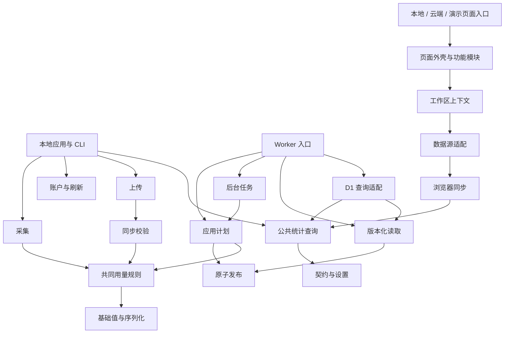

# 模块架构与并行开发

[开发说明](../CONTRIBUTING.md) · [统计与接口契约](TECHNICAL_REFERENCE.md) · [云同步协议](CLOUD_SYNC_V3.md) · [本次重构验收](architecture/refactor-20260912.md)

项目使用一个仓库和现有构建工具，以逻辑模块划分责任。`apps/` 负责启动、装配和 HTTP 入口，`modules/` 负责可独立修改的业务能力。模块边界由 [modules.json](../modules.json) 和 [架构检查器](../tooling/check-architecture.mjs) 执行。

目标是让一个功能的主要修改集中在所属模块，让多个任务可以约定接口后分别工作。公共统计规则、协议和事务提交点仍需要协调；目录拆分不会使这些共同约束消失。

## 运行数据与版本门禁

每台电脑只读自己的 Codex 日志，同一条提取流供本地物化和云端上传使用。云端通过 v3 字段白名单接收任务元数据与用量，对跨设备副本去重；它不能读取电脑的文件系统。账户额度沿独立支路采集，身份转换为按云端用户隔离的 HMAC 标识，与日志用量分别统计。

网页从云端读取一致版本的结果或增量，按用户与 epoch 存入 IndexedDB，并复用完整统计界面。三端严格匹配 `3.1.2`：上传在解压前鉴权并核对协议；统计要求全部未撤销设备完成匹配握手，暂停设备也参与核对。网页周期复核及请求中的版本拒绝可关闭统计和缓存，设备筛选不能绕过门禁。设备通过握手后可以离线，云端保留历史；最后一次版本报告不代表离线设备此刻的运行状态。

原协议切换与空库初始化属于[此前部署记录](design/protocol-preview-2026-09-12.md)。本次保持该协议与存储，不执行再次清库；详细格式、限制与恢复规则见 [Cloud Sync v3](CLOUD_SYNC_V3.md)。

## 目录与责任

| 位置 | 负责的变化 | 边界 |
| --- | --- | --- |
| `apps/local/` | 本地进程、CLI、Fastify 路由和服务装配 | `composition.ts` 创建并连接采集、账户、上传和查询服务；HTTP 文件按领域注册路由 |
| `apps/cloud/` | Worker 入口、认证、设备与协议门禁、路由 | 使用领域模块执行事务、查询和任务，不实现另一套统计规则 |
| `apps/web-local/`、`apps/web-cloud/`、`apps/showcase/` | 三个网页的启动、能力与数据适配 | 复用完整页面；本机、云端和演示数据保持独立入口 |
| `modules/foundation/` | 无运行环境依赖的值处理、序列化、时间范围 | 不导入业务层、Node 或浏览器专属实现 |
| `modules/contracts/` | API DTO、领域类型、同步协议和数据源接口 | 按账户、设置、查询、状态、同步分文件；不承载数据库或页面状态 |
| `modules/usage/` | 日志归一化、精确 Token、规范事件选择、执行来源证据 | 本地和云端使用相同的计算规则 |
| `modules/settings/` | 价格目录、默认值、校验和 Worker 设置适配 | 定价模型独立于页面表单和存储实现 |
| `modules/analytics/` | 筛选、查询计划、精确聚合、查询执行接口 | SQLite 与 D1 执行器分别适配；公共查询不导入具体本地 Store |
| `modules/accounts/` | 账户能力、凭据解析、RPC、额度和历史刷新、快照发布 | 账户信息与本机记录分开统计和报告错误；Worker 适配有独立运行环境边界 |
| `modules/collection/` | 来源发现、分帧、增量采集、过滤投影、本地物化和 outbox | 一条提取流服务本地与上传消费者；原始日志只读 |
| `modules/organization/` | 项目身份、项目归并、设备归属和规则预览 | 纯规则、本机解析、Worker 管理分别拥有边界；后台执行在 jobs |
| `modules/sync/protocol/` | 上传契约的运行时校验 | 不让 DTO 反向依赖物化、网络或数据库 |
| `modules/sync/upload/` | 绑定会话、凭据、不可变上传账本、重试、确认 | 收到与应用确认分开；重试复用原字节和身份 |
| `modules/sync/apply/` | 上传应用计划、来源变更、候选事实、规范化与重建 | 规划和提交分开；竞争失败重新规划 |
| `modules/sync/publication/` | 版本头、条件保护、聚合与原子发布 | 单次 D1 batch 包含保护、全部效果、确认和版本推进 |
| `modules/sync/jobs/` | 租约、恢复、预算和各类任务处理器 | 任务类型独立，按有界步骤继续，不在 HTTP 请求内无界重算 |
| `modules/sync/reads/` | 固定读取版本、baseline、changes、实体快照、清理 | 同一次读取遵循同一个 read cut，保留分页和恢复语义 |
| `modules/sync/browser/` | 传输、校验、IndexedDB、内存缓存、同步控制器 | 不依赖 React；缓存按 origin、user、epoch 隔离 |
| `modules/web/` | 数据 hooks、通用 UI、领域组件、功能页面、应用外壳 | 分析、总览、账户、设备、项目、设置各自拥有文件；运行上下文由 Provider 注入 |
| `modules/storage/`、`modules/platform/` | 本地 SQLite 和 Node/Worker 平台适配 | 不把文件系统、进程、启动项等能力带入网页 |
| `tooling/`、`scripts/` | 架构门禁、按模块测试、构建和验收 | 生成版本在忽略的 `tooling/generated/`；构建产物不写进业务目录 |

`modules.json` 中有 43 个逻辑边界，数量包含同一业务目录的运行环境适配、应用入口及网页功能模块。它们不是 43 个独立发布包。分配任务时以清单的 `id`、`paths`、`public` 和 `dependencies` 为准。

## 依赖方向

下图展示主要依赖；完整的文件级依赖可通过架构检查输出 JSON。箭头表示调用方依赖提供方。



三条关键边界：

1. 公共计算只认识 DTO、查询计划和执行接口。Node SQLite、D1 与演示 SQLite 保持各自适配，同时共享精确统计、空值和价格行为。
2. `PublicationPlan` 可以拆开准备，提交必须经同一个 `PublicationStore.commit()`。事件、聚合、回执和版本头不能分别提交。重建、租约与设备保护仍参与事务判断。
3. 页面通过 `WebRuntimeProvider` 获得数据源、时钟、项目名称解析器和能力。每个工作区拥有实例；不再安装全局云端数据源或全局云端时钟。`sync/browser` 不引用 UI 框架。

## 模块规则

每条跨模块 import 必须同时满足：调用方声明了依赖；目标文件属于被调用模块的 `public`；运行环境兼容。规则同样检查 `import type`、重导出和字面量动态 import。纯模块可被任何环境引用；Node、Worker 和 browser 专属模块不能互相引用。

文件级运行依赖、包含类型的依赖及逻辑模块依赖都不允许形成循环。网页模块不能引入 `cloudMode`、`exampleMode`、可变全局数据源或 `import.meta.env`；部署差异由入口和能力对象表达。

新增私有文件放入模块已声明的 `paths` 即可。新增公共入口或依赖需要说明消费者和原因，执行消费者验收后修改清单。不要为了使检查通过而扩大整目录公开权限，或把领域逻辑堆进 foundation、contracts、通用 UI。

检查器基于静态 import 与字面量动态 import，不是沙箱或运行时安全证明。不要用计算路径的动态加载绕过模块约束。

## 如何开多个任务

先确定共享接口，再按所有权拆任务。一个任务卡至少写明目标行为、允许修改的模块、使用的公共入口、需要保持的契约、验收命令和依赖任务。用户要求并发时按[项目工作流](../.agents/workflow.md)创建独立 worktree；不同任务不要共享同一个正在修改的工作目录。

可以同时进行的例子：

| 任务 | 主要所有权 | 常用验收 |
| --- | --- | --- |
| 改进日志来源发现 | `collection`，必要时 `usage` | `npm run test:module -- collection` |
| 增加分析页交互 | `web/analysis` | `npm run test:module -- web/analysis`，本地/云端页面 CUA |
| 调整账户提供方错误处理 | `accounts` | `npm run test:module -- accounts` |
| 优化云端重建分批 | `sync/apply`、`sync/jobs` | `npm run test:module -- sync/apply sync/jobs` |
| 改进浏览器恢复同步 | `sync/browser` | `npm run test:module -- sync/browser`，隔离 Worker + CUA |

公共契约、`modules.json`、应用装配、全局样式与锁文件由本轮集成任务协调。契约稳定后的内部修改可并行；若某任务需要更改消费者使用的 DTO 或入口，先给出契约差异和迁移方式，再让消费者任务继续。共享源码存在合理依赖，因此不能承诺任意修改都只碰一个文件或完全没有合并冲突。

按模块测试运行清单中的既有回归用例；它不会自动推导全部受影响消费者。修改公共统计、同步协议或发布事务时，应执行完整本地和云端套件。页面行为变化还需三个入口的相关验收。

```powershell
npm run architecture:check
npm run test:module -- web/runtime web/data
npm run check
npm test
npm run cloud:check
npm run cloud:test
npm run build
npm run cloud:build
npm run showcase:build
npm run smoke
npm run package:smoke
```

本地代码编译到 `dist/apps/local/` 与 `dist/modules/`；网页继续输出 `dist/web/`、`cloud/build/`、`showcase/build/`。Worker 配置继续使用 `cloud/wrangler.jsonc`；展示站配置位于 `apps/showcase/wrangler.jsonc`。部署、提交、集成与 npm 发布仍按工作流和具体任务授权执行。

## 兼容性与后续维护

本次内部重构保持协议 `3.1.2`、统计 revision `token-usd-v1`、本地数据库版本和 `cloud/migrations/0001_v3.sql`。HTTP 路由、CLI、JSON 字段、Token 精度、缺失值、统计口径和三个页面入口继续兼容，不要求清空数据。

现存内部算法仍有复杂度，例如增量采集、上传状态机和精确查询。它们现在有明确所有权与依赖门禁；后续可以在模块内改进，继续以现有行为测试约束。多任务效率最终需要在真实并发开发中观察；循环消除和所有权清单是可验证的基础，不是效率倍数的保证。
