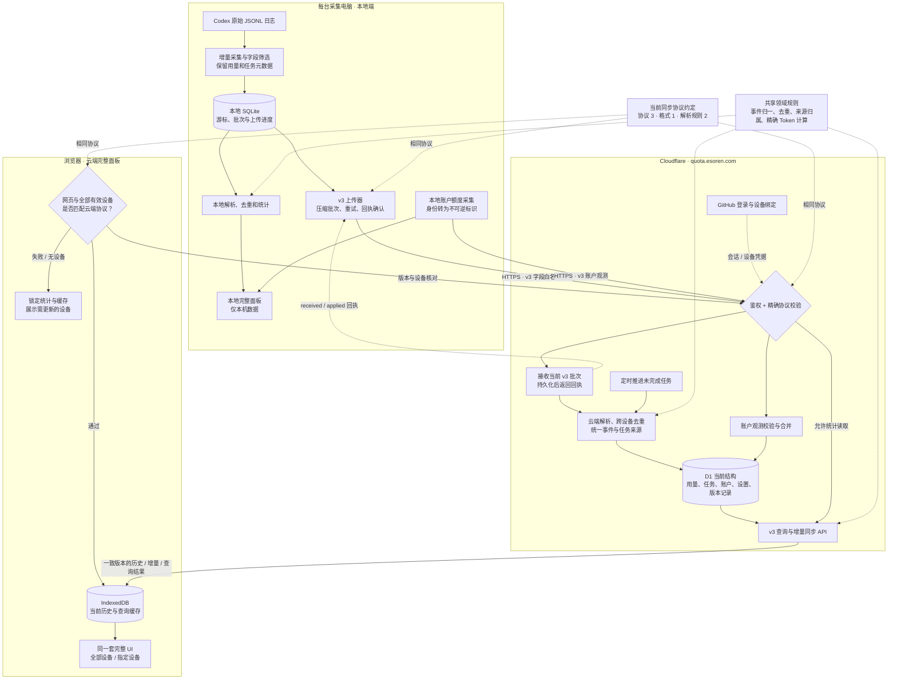

# Codex Usage 当前架构

当前方案：一个 v3 协议，一套共享统计规则，本地端、云后端、网页严格匹配当前同步协议。此图描述待部署代码；线上状态须在部署后单独验收。

## 数据怎样走

1. 每台电脑读取自己的 Codex 原始日志，筛选允许同步的字段，持久化读取位置与批次。聊天正文、工具内容和凭据不会上传；任务标题与项目路径按产品既有要求保留。
2. 同一批记录分别供本地统计和云端上传使用。云端解析当前协议的记录，并对多台设备保存的同一任务副本去重；云端没有访问电脑文件系统的能力。
3. 云端 D1 保留已接收的历史。网页从 v3 API 获得一致数据版本的查询结果或历史增量，缓存到 IndexedDB，复用完整统计界面。
4. 账户额度是独立采集支路，身份在本地转换为按云端用户隔离的 HMAC 标识，再合并账户观测。它与日志用量一起展示，但不会混为同一种统计。

## 版本关系

- 三端严格匹配当前同步协议 `3.1.2`。网页与后端一起部署；源码指纹用于定位部署来源。普通界面修改或内部优化不改变协议，也不要求重新安装采集器。
- 上传先鉴权、核对协议，匹配后才能解压和接收；缺失或不同协议返回 HTTP 426。
- 查看统计还要求网页和所有未撤销、未删除历史的设备版本匹配。暂停设备也参与核对，筛选设备不能绕过此规则。
- 网页每 15 秒复核，并响应请求中的版本拒绝；不匹配时隐藏统计和缓存。登录、绑定和设备管理继续可用。
- 已通过握手的采集电脑可以关机，历史仍在云端。这里核对的是设备最后一次经过身份验证的版本报告，不能证明关机电脑当前运行什么版本。网页需要连接云端完成版本核对。

## 这次上线的存储处理

使用新的空 D1 和空本地数据目录，由当前采集器重新读取原始日志。旧应用数据库与旧浏览器缓存不转换、不导入。旧 D1 和旧本地目录可保留作备份，但不会接入新应用的数据读取路径。

旧 v1/v2 接口、迁移暂存、旧格式转换、查询回退和仅额度同步升级流程均已移除。保留的是当前协议需要的断点续传、去重、回执与任务恢复。

源码入口：`server/collector/`、`server/local-materializer.ts`、`server/sync-v3/uploader.ts`、`cloud/src/version-gate.ts`、`cloud/src/v3/`、`web/CloudWorkspace.tsx`、`web/cloud-sync/`、`shared/usage-domain/`。
