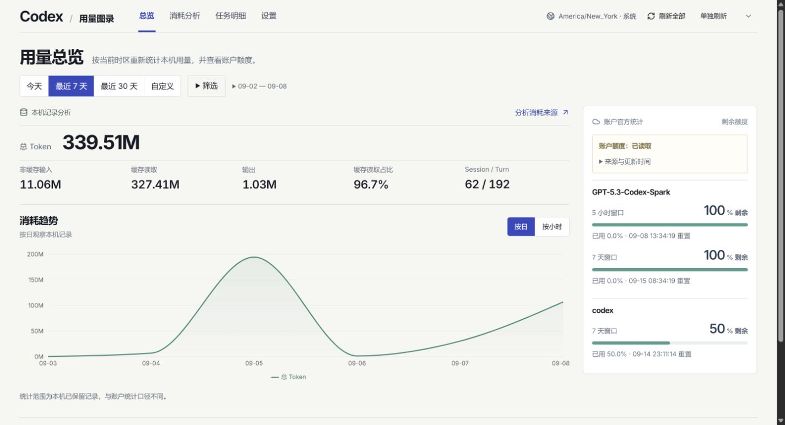
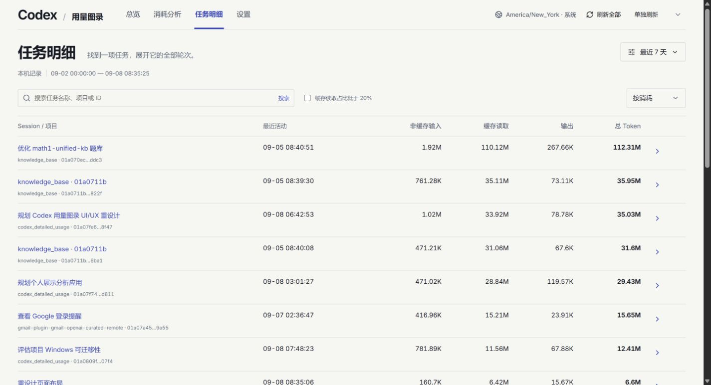
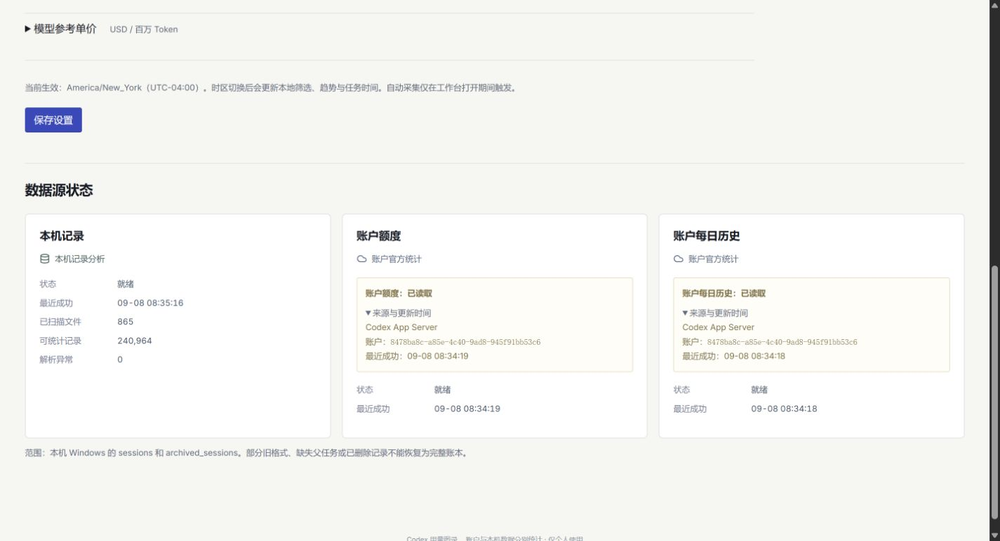
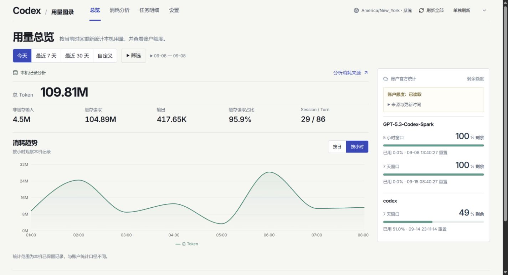

# 布局重设计验收 · 2026-09-08

在 Codex 内置浏览器中检查 `http://127.0.0.1:8765` 的生产构建。使用现有本机数据；统计数字会随自动刷新变化。截图尺寸是 CSS 视口尺寸。

## 首页

桌面使用本机摘要与趋势主栏、320px 账户额度侧栏。默认时间筛选工具栏高 40px，高级条件通过浮层设置；条件标签保留在页面上。图表高 260px，包含坐标轴和总 Token 图例。

| 视口 | 筛选区高度 | 图表底部 Y | 额度区底部 Y | 页面横向溢出 |
| --- | ---: | ---: | ---: | ---: |
| 1440 × 780 | 40 | 708.4 | 686.6 | 0 |
| 1280 × 720 | 40 | 708.4 | 686.6 | 0 |
| 1024 × 768 | 40 | 739.8 | 1294.0 | 0 |
| 768 × 900 | 40 | 789.8 | 1344.0 | 0 |
| 390 × 844 | 102 | 994.9 | 1549.0 | 0 |

桌面默认筛选、参考成本关闭、现有两组账户额度的情况下，摘要、完整趋势图和额度同时出现在首屏。1200px 以下按摘要、趋势、额度顺序纵向排列；手机允许页面滚动。新增更多账户窗口、打开说明或启用更多指标时允许内容自然增高。

## 任务与设置

- 在上述五种尺寸下，任务标题、工具栏和表格左边界分别为 36、24、24、22、16px，三者误差均为 0px。
- 所有表格列保持可访问，窄屏在表格容器内滚动。五种尺寸均无整页横向溢出。
- 数据源在 1440/1280px 为三列，在 1024/768/390px 为单列，所有卡片内边距均为 20px。
- 消耗分析页在上述五种尺寸下均无整页横向溢出；检查了窄屏时间面板及其高级筛选浮层。

## 交互与构建检查

- 模型选择、生效计数、关闭浮层、移除条件标签及 URL 更新通过。
- 自定义起止时间应用通过；切回最近 7 天清除自定义时间参数。
- 搜索无匹配结果、清除搜索、按最近活动排序、下一页、任务详情下钻通过；返回列表保留 `sort=recent&sessionOffset=20`。
- 临时开启参考成本后，在 390px 视口验证缓存写入、成本与全部 Token 列均显示为表格列，页面横向溢出为 0；随后恢复成本关闭并确认保存成功。
- 图表通过键盘方向键显示精确值提示，提示框位于视口内；图例显示“总 Token”。
- 页面加载状态在浏览器检查中出现；空数据、缺少 CLI、账户能力独立错误由现有 smoke 检查覆盖，未为视觉检查故意中断真实账户服务。
- `npm run check`、38 项现有测试、最终 `npm run build`、`npm run smoke` 和 `git diff --check` 通过。浏览器检查未发现 error 级别日志。
- 构建仍有主 JS chunk 大于 500kB 的提示；本次未改变打包拆分方案。

[手机首页首屏截图](overview-mobile.png)

## 后续修正：时间范围与图表粒度联动

- “今天”默认按小时，最近 7 天／30 天默认按日；切换时间范围清除上一范围的手动粒度。当前范围内手动选择仍然有效，分析页下钻显式指定的粒度也保留。
- 自定义不超过 24 小时的范围，以及完整的本地单日范围默认按小时，兼容夏令时结束时的 25 小时一天。
- 首页小时横轴显示 `HH:mm`。目前使用真实小时统计，未增加 30 分钟或 15 分钟分桶。
- 内置浏览器验证：直接进入 `?range=today`、手动按日后再点今天、切换最近 7 天／30 天、跳转分析页均选择预期粒度。首页已显示 01:00–08:00 的小时趋势。
- 新增 3 项粒度回归测试，总计 41 项测试通过；生产构建、smoke 和 diff 检查通过。

