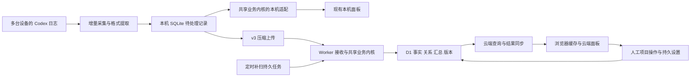

# 多设备云端面板具体实施方案

日期：2026-09-11；状态更新：2026-09-12。状态：**用户批准的功能已实现，后续选中的 9 项缺陷已修复并定向复验，S05 窄窗口菜单仍待处理；性能改进按用户要求暂缓。** 见[修复报告](multi-device-cloud-panel-fixes-2026-09-12.md)与[原全面验收](multi-device-cloud-panel-acceptance-2026-09-12.md)。外部验收和生产发布待后续安排，当前完成情况和验证边界见[实施记录](multi-device-cloud-panel-implementation-progress-2026-09-11.md)。

需求依据：[批阅后需求](multi-device-cloud-panel-requirements-2026-09-11.md)。本文保存确定的实现、改动位置、迁移顺序和验证条件；其中技术选择是本方案的设计决定，不冒充此前用户逐项确认。实际完成情况以实施记录为准，不能将方案中的全部验收条件视为已通过。批阅原稿、实验目录及原始证据保持不变。

## 1. 方案结论

采用 **现有 Node.js 本机服务＋共享业务内核＋Cloudflare Workers／D1＋浏览器 IndexedDB 结果缓存**。采集器从原始日志提取必要记录，本机与云端分别调用同一份业务内核形成各自的数据视图。云端负责跨设备去重、执行来源、项目组织和统一查询，浏览器按用户设置同步已经解析的结果。

| 事项 | 本方案的明确选择 |
| --- | --- |
| 产品入口 | 保留本机面板；云端面板支持一台、任意设备子集和全部设备 |
| 云端基础设施 | 复用现有 Worker、D1、GitHub 登录和绑定机制；第一版不增加 R2、Queues、DO、KV |
| 后台续作 | D1 保存短期任务／待应用批次，Worker 请求推进，Cron 每分钟补扫未完成任务；不依赖访问页面持续打开 |
| 协议 | 新增 v3 采集协议；直接传输一个 gzip JSON 包，移除实验请求中的逐包 base64 套层 |
| 业务代码 | 抽取纯 TypeScript 内核，Node 和 Worker 共用；实验代码只作为移植和验证依据，不成为产品运行依赖 |
| 云端存储 | 保存当前结构化来源事实、全局有效事件、关系、必要汇总和人工设置；临时同步状态按用途回收，不建立长期原始投影档案 |
| 正确性 | 全局确定有效消耗后再按执行设备筛选；人工拆分和设置由云端保存；所有用量相关写入经过同一版本保护 |
| 浏览器 | 保留原查询组件，通过云端数据适配器接入；近期／全量共用同步状态，IndexedDB 保存已解析实体与页面结果 |
| 平台 | 保留 Windows x64、macOS x64／arm64，增加 Linux x64／arm64；Node 支持范围沿用现有 package.json |
| 推进方式 | 先完成最小真实链路，再接入全部业务和页面，最后验证多设备、迁移及性能 |



定时补扫只运行云端已经持久接收的工作，不向其他电脑发送采集指令。正常小批次直接完成应用，后台任务主要承接大重建、删除及失败续作。

## 2. 现有代码如何使用

本轮进行了只读代码检查，以下为当前工作区事实，不引用旧“已完成”文案作为新架构验收。

| 现有位置 | 已有基础／具体缺口 | 本轮改造方式 |
| --- | --- | --- |
| [collector-v1](../../experiments/collector-v1/README.md) | 完整行读取、来源身份、代次、事务游标、压缩待发包、监听和轮转已有实验；尚无正式 HTTP 上行 | 移植到 `server/collector/`，接入产品 SQLite、生命周期和上传执行器 |
| [Importer](../../server/importer.ts)、[Store](../../server/db.ts) | 新旧格式、累计高水位、fork 继承、明确记录替代兼容记录、本机查询表 | 抽取确定性语义；保留旧路径作迁移对照，最终由共享内核写本机视图 |
| [V5 内核](../../experiments/parser-placement-v5/kernel.mjs)、[索引](../../experiments/parser-placement-v5/index.mjs) | 明确用量的候选选优、before／after 差分、BigInt 汇总已有验证 | 保留已验证算法；补旧累计、标题、项目和正式事务；不照搬 slot、全局分片 JSON 和固定三页布局 |
| [本机同步](../../server/usage-sync.ts)、[连接管理](../../server/cloud-sync.ts) | 现有绑定、凭据、账号代读和 v2 整会话上传 | 复用连接与账号身份，将用量上行切为持久变化队列；取消每轮全历史比较及固定四请求节拍 |
| [云端查询](../../cloud/src/usage-query.ts) | 目前在候选去重前筛选上传设备；账号来源也被同一设备筛选限制 | 改查全局有效事件，筛选 `origin_device_id`；账号查询独立于设备用量筛选 |
| [共享查询](../../shared/query-engine.ts)、[契约](../../shared/contracts.ts) | 已有页面业务口径和精确字符串返回；D1 适配仍改写 SQL 文本 | 复用业务语义与 DTO，拆出明确查询计划／数据库适配，移除字符串替换式 SQL 修补 |
| [Web 数据入口](../../web/workspace.ts)、[App](../../web/App.tsx)、[云端空间](../../web/CloudWorkspace.tsx) | 原有页面、路由、刷新入口可保留；尚无完整浏览器持久同步层 | 增加数据源适配、同步控制器与 IndexedDB；各页继续使用统一入口 |
| [平台](../../server/platform.ts)、[CLI](../../server/cli.ts)、[服务入口](../../server/index.ts) | 后台守卫和平台检查排除 Linux；浏览器启动只分 macOS／Windows | 增加 Linux 路径、进程守卫、浏览器启动和自启动能力检测 |
| [包声明](../../package.json)、[平台 CI](../../.github/workflows/windows.yml)、[CI 复用](../../scripts/ci-reuse.mjs) | npm `os` 排除 Linux；当前矩阵为 3 平台目标×6 Node 版本，复用规则固定这 18 项 | 增加两个 Linux 目标并同时修改精确文件树验收规则，形成 30 项矩阵 |

当前同目标分支是 `codex/cloud-quota`，工作区包含既有未提交实现。进入实施时先记录当前差异并归属现有工作，不切换、覆盖或清理这些修改；同一目标继续使用原任务分支。提交、PR、部署和发布遵循[项目工作流](../../.agents/workflow.md)及实际授权范围。

## 3. 模块划分和代码落点

以下新路径是拟创建位置，尚不存在。

| 模块 | 拟创建／主要修改位置 | 职责 |
| --- | --- | --- |
| 协议与实体 | `shared/sync-v3.ts`、`shared/usage-domain/types.ts` | 带版本的输入、确认、实体、查询元数据与错误码 |
| 业务内核 | `shared/usage-domain/normalize.ts`、`legacy.ts`、`identity.ts`、`canonical.ts`、`metrics.ts` | 无文件／网络／数据库调用的确定性转换、选优和差分 |
| 项目组织 | `shared/usage-domain/projects.ts`、`server/collector/projects.ts`、`codex-projects.ts` | 本机证据提取与云端纯关系计算分开 |
| 本机采集 | `server/collector/framing.ts`、`projection.ts`、`store.ts`、`scheduler.ts` | 文件发现、完整行、来源代次、事务游标和公平调度 |
| 本机适配 | `server/local-materializer.ts`、现有 `server/db.ts`／`refresh.ts` | 同一提取流形成本机查询视图，维持现有本机 API |
| 上行 | `server/sync-v3/uploader.ts`、`codec.ts`、现有 `server/cloud-sync.ts` | 持久请求、压缩、双通道、确认与重试 |
| 云端处理 | `cloud/src/v3/ingest.ts`、`apply.ts`、`store.ts`、`jobs.ts` | 鉴权后接收、事务应用、版本发布和任务恢复 |
| 云端查询／同步 | `cloud/src/v3/queries.ts`、`snapshots.ts`、`changes.ts` | 页面查询、固定版本的分批下行、短期变化流 |
| 云端管理 | `cloud/src/v3/projects.ts`、`settings.ts`、`devices.ts`、`accounts.ts` | 人工操作、共享设置、设备删除与额度选源 |
| Web 适配 | `web/data-source.ts`、`web/cloud-sync/controller.ts`、`cache.ts`、`provider.tsx` | 统一数据访问、缓存、两轮初始化和页面版本 |
| Linux | `server/linux-autostart.ts`，调整 `platform.ts`／`runtime.ts`／`cli.ts` | XDG 路径、systemd 用户服务、无桌面运行和能力反馈 |
| 迁移 | `cloud/migrations/0003_sync_v3.sql`、`0004_sync_v3_views.sql`，本机版本迁移函数 | 只追加迁移，不修改已用迁移文件；分步建表、回填与切换 |

实施时不机械地给每个辅助函数拆文件；表中边界用于避免协议、I/O 与业务规则重新混在一起。现有页面组件原则上只修改数据接入和必需的设备／项目行为。

## 4. 数据身份与事件规则

### 4.1 不同身份分别承担什么用途

| 身份／版本 | 生成和保存 | 用途 |
| --- | --- | --- |
| `user_id` | 现有 GitHub 登录映射；从鉴权取得 | 云端数据域，不信任请求体自报用户 |
| `device_id` | 现有绑定设备记录 | 上传来源、暂停／撤销／删除范围 |
| `collector_id` | 独立持久身份文件；升级和重建统计库时保留 | 本机采集实例，绑定到所属用户和设备，不作为凭据 |
| `source_id`／`source_generation` | 本机持久来源注册与文件代次 | 续读、替换、处理游标和来源事实 |
| `observation_id` | 采集实例、来源、代次及完整记录位置组成的稳定键 | 同一来源观察的重传与修订 |
| `event_id` | 依据消耗的强身份，由共享规则生成 | 跨设备有效消耗去重，与上传位置分离 |
| `origin_device_id` | 明确执行来源及证据；未知可为空 | 设备消耗筛选，不从上传设备无条件覆盖 |
| `source_project_id` | 本机项目注册；映射以采集身份为命名空间 | 保留原始项目和路径；重新采集时尽量重用 |
| `logical_project_id` | 云端项目组织层生成并维护别名 | 自动与人工组织、页面稳定引用 |
| `dataset_epoch`／`commit_seq` | 云端生成 | 大切换与该代内发布顺序；不同于采集源修订 |
| `account_ref` | 复用现有用户域 salt 和账号身份 HMAC | OpenAI 账号共享额度，与 GitHub 身份分开 |

新设备绑定不同凭据时，不改变已有事件的执行来源。恢复后丢失本机映射，可以从本人空间取回相关注册信息；没有可靠映射的情况按既定未知来源处理，不凭设备名猜测合并。

### 4.2 事件归并与旧格式

1. 有有效 `response_id` 的用量，以用户域内 response 身份为主键；重复报告、跨设备副本和 fork 中继承的同一 response 不产生第二份消耗。相同 ID 的不同来源保留各自候选和冲突标记。
2. 没有 response 身份时，使用可信 Session、记录谱系和原始记录位置映射。原样复制的公共前缀需结合会话身份和完整记录链校验建立映射，保留各上传来源；不能仅使用时间／Token／标题指纹去重。
3. 旧累计格式按来源顺序维护高水位、上一签名、turn 上下文和继承边界；明确记录与旧兼容记录的替代沿用现有业务口径。将规则提取后，用独立样例检查部分明确记录、重复累计、累计回退和父任务晚到，发现旧口径问题时显式记录修正，不隐藏差异。
4. 跨来源 `source_revision` 不可相互比较；同观察的新修订更新旧候选，旧修订忽略，同修订不同内容报错。候选优先级由字段完整度、可信身份和来源证据确定，同级冲突用稳定顺序并保留质量标记，不使用设备时钟“最后到达者胜出”。
5. 先得到一个全局有效事件，再按 `origin_device_id`、时间、项目等查询。一次修订输出 `before/after`，撤回旧贡献、加入新贡献；标题和关系更新独立于 Token 变化。

原始历史没有提供足够身份信息时，算法不能从新 UUID 反推出过去的执行机器。对已确认的特殊旧历史保留未知和人工归属；也不宣称无身份、无谱系、不可区分的输入已经获得完美去重证明。M1 必须把可证明的复制场景、独立相似场景和信息不足场景分别留证，不能用弱指纹掩盖缺口。

### 4.3 精确数值与查询效率

传输和有效事实中的 Token 保持规范十进制字符串／null；业务计算使用 BigInt。D1 不直接传入或取回 JS BigInt，SQL INTEGER 聚合也可能溢出，因此不能只在 `SUM` 外加 `CAST AS TEXT` 就宣称任意规模精确。[D1 类型转换](https://developers.cloudflare.com/d1/worker-api/#type-conversion)、[SQLite 聚合规则](https://www.sqlite.org/lang_aggfunc.html#sumunc)

采用两条明确路径：常用汇总以 BigInt 差分计算，存十进制 TEXT；任意过滤查询在**同一固定版本**先确认所有参与值及聚合上界可落入有符号 64 位，再走整数 SQL 并将结果在 SQL 中转 TEXT。单值或保守求和上界超限时，改为有界分页读取精确 TEXT、在 Worker 中 BigInt 计算。安全上界使用 `匹配行数×最大绝对值`，在 JS BigInt 中判断，不由浮点数判断。

数字排序按精确数值处理：规范非负十进制可以用位数＋字典序排序；不把大数字转 Number 排名。缺失计数、有效配对的缓存比例、成本规则仍独立维护。distinct 任务／轮次数按身份或成员引用计数求得，不相加重叠日桶。

## 5. 本机采集与保留本机面板

### 5.1 本机持久结构

在现有 `usage.sqlite` 中新增采集来源、格式上下文、待处理批次、消费者进度和上传请求表；独立身份文件继续保留。采集检查点、必要提取记录和待处理状态在一个 SQLite 事务提交。不要把游标写进一库、待发数据写进另一库后视为原子保存。

同一提取批次有本机解析、云端同步两个消费者。本机解析成功后在其事务记录进度；上传成功后记录云端确认。只在所需消费者均完成后清理临时批次。未绑定云端时只启用本机消费者，不无限囤积为未来上云准备的待发包；之后首次绑定通过可恢复的完整采集构造云端基线。

最终每份原始日志只有一条日常读取／提取路径。本机面板继续使用本机视图和原 API，不等待上传；迁移对照期允许旧 importer 与新路径处理固定副本进行比较，切换后停止双重扫描。

### 5.2 调度与初始参数

| 项目 | 初始实现值／规则 |
| --- | --- |
| 文件通知 | 复用实验 `fs.watch` 去重队列，25 ms 合并窗口；每 30 秒目录复核兜底 |
| 文件读取 | 256 KiB 读块；约 8 MiB 后在完整记录边界让出；新通知优先，历史按老化轮转 |
| 来源顺序 | 同一来源代次按完整行顺序解释累计上下文；不同来源可轮转 |
| 首次近期优先 | 优先活跃和近期文件；没有可信上下文检查点时不从大文件尾部直接算累计差额 |
| 元数据 | 增量标题；Git 和 App 项目证据缓存，目录／配置变化后失效，不按每条记录启动 Git |
| 休眠恢复 | 唤醒后复核变化与待发状态，只补实际缺口，不重放每个错过的计时周期 |
| 写入失败 | 本次游标不前进、保留可恢复状态并报告普通错误；不增加容量专项产品界面 |

这些参数继承实验起点或本方案选择；通过完整链路测量调整，不再将每个内部数值列为用户取舍。

### 5.3 Codex 已保存项目的具体接入

本轮只读检查确认，当前本机状态库有 `projects(id,name,...)`、`project_roots(project_id,position,path)`，以及 `threads.project_id`。实现新增只读适配器，探测已识别 schema 后仅查询这些白名单字段和必要的 thread ID；不读取聊天预览、首条消息或任意 metadata 内容。

优先级为：可信 Git 仓库证据 → App 项目及其根目录 → 明确的独立对话 → 未解析。独立对话不能仅由“缺少项目映射”推断；当前 App 全局状态中的 projectless 标识仅由对应 schema 适配器读取。不同平台或版本的映射格式必须探测和验证，禁止直接硬编码只支持 `state_5.sqlite` 的版本号。

Git 使用主要 remote：结合明确的 `origin` 和当前分支跟踪 remote；两者指向不同仓库且无法证明主要仓库时保留歧义，不建立跨仓库自动归并边。去除凭据、规范协议／主机和 `.git` 后缀时保留仓库路径语义，不把 fork 的 upstream 自动作为主仓库。暂时不可访问的历史路径使用已有持久证据，不伪造当前 Git 查询结果。来源项目身份包含规范化根目录，Git common directory 和 App 项目 ID 作为关系证据，不能掩盖路径变化产生的新来源。

## 6. v3 上行协议

### 6.1 请求和确认

新增 `POST /api/v3/ingest`，设备 Bearer 凭据沿用当前绑定。请求体为一个 gzip 压缩 JSON，使用应用专用媒体类型标明压缩格式；由接收器显式解码，避免依赖代理是否自动处理 `Content-Encoding`。传输摘要与解压内容摘要各自命名，不能混用。

```text
UploadBatch
  protocol=3, schema_version, extractor_version
  collector_id, producer_epoch, lane=live|backfill, lane_seq
  batch_id, records_hash
  sources[]: source_id, generation, from_cursor, to_cursor, context_hash
  records[]: observation_id, record_revision, source reference, locator,
             origin evidence, context, whitelisted record
  metadata[]: title / project evidence / source availability

Ack
  batch_id, wire_hash, records_hash
  status=received|applied, received_at
  dataset_epoch, applied_commit_seq
  contiguous_received_seq, contiguous_applied_seq
  retry_after_ms, current_config_version
```

所有输入都有长度、记录数和解压后字节限制；不接收聊天正文、工具输出或账号凭据。一个 `batch_id` 对应不可变字节，同 ID 同摘要返回已有确认，同 ID 不同摘要拒绝。普通包作为一个原子应用单位，第一版不引入逐记录部分成功。

### 6.2 大小、连续上传和失败处理

| 项目 | 初始设计 |
| --- | --- |
| 日常上传合并 | 250 ms，最长等待 1 秒；不足目标大小也发送 |
| 请求目标 | 512 KiB 解压后内容或 500 条提取记录，先到者封包；常规硬上限 1 MiB 解压内容／512 KiB 线上包 |
| 特大必要记录 | 封为专用批次并走受控任务路径；如果字段超契约上限，停在可恢复位置并报明原因，不截断或丢弃 |
| 在途请求 | 每设备最多 2 个，一条 live、一条 backfill；同一来源不能同时被两条通道跨序推进 |
| 通道调度 | 每通道按序，live 优先；持续高负载给历史保留至少每四次调度一次的机会，空闲份额互相借用 |
| 压缩 | gzip level 1，异步压缩；持久保存最终请求字节，重试不重新编码 |
| 超时与重试 | 单次 HTTP 起点 15 秒；指数退避＋抖动，尊重 Retry-After；响应结束即释放下一个请求名额 |
| 永久错误 | schema／身份冲突暂停对应来源并报告；撤销停止该绑定，不能无限重试 |

包的目标大小、SQL 事务大小和业务工作集是三种限制。封包后若受影响关系超出普通应用预算，整个包进入持久任务，不切成会暂时破坏语义的部分更新。

收到 `received` 表示云端已持久保存输入和任务，本机将其标为已接收但仍保留到 `applied`；用正常 ACK 或 `GET /api/v3/receipts?ids=...` 补取结果，不重复发送已持久接收的大包。两个连续进度分别按无缺口序号推进，不能把最大收到序号当作完整应用。

同来源旧累计记录不允许跳过前序上下文直接应用。独立来源的 live 新数据可以先行，不被另一个历史来源的缺口阻塞。

## 7. 云端持久结构与事务

### 7.1 D1 数据表

沿用 `users`、`devices` 与登录／绑定表。新增表按用途组织；所有主键、唯一约束和查询范围含 `user_id`，或通过不可跨用户的外键限定。

| 表／表组 | 主键或主要索引 | 保存内容 |
| --- | --- | --- |
| `sync_domains` | 用户域主键 | active epoch、write version、commit seq、设置／组织／删除版本 |
| `collector_sources` | 用户、collector、source、generation | 已应用游标、当前解析上下文、来源可用性与代次状态 |
| `source_candidates` | 用户、observation；event／device 反向索引 | 当前结构化来源事实和身份／执行来源证据，用于选优、修订和按上传者删除 |
| `canonical_events` | 用户、epoch、event；时间／thread／origin／project 索引 | 一份全局有效事件、精确值、质量状态、实体修订 |
| `threads`／`thread_edges` | 用户、thread；父子边索引 | 标题、turn 关联、fork／Agent 的不同关系 |
| `source_projects`／`project_evidence` | 用户、source project；仓库／Session 关联索引 | 来源路径、App／Git 证据与自动关联原因 |
| `project_rules`／`project_members` | 用户、规则 ID／来源项目 | 人工合并拆分、名称、当前逻辑项目映射及稳定别名 |
| `usage_aggregates` | 用户、epoch、维度键 | 按日、Session、执行设备及必要项目／模型维度的稀疏汇总，不物化所有筛选组合 |
| `sync_receipts`／`producer_progress`／`apply_guards` | 用户、collector、producer epoch、lane、seq；batch／operation 唯一 | 摘要、确认结果和连续水位；CHECK 门闩行只在应用事务中存在，确认后不保留原包正文 |
| `pending_inputs`／`jobs` | 用户、job；状态和下次执行时间 | 临时待应用内容、分段检查点、租约与错误状态 |
| `sync_changes`／`entity_versions` | 用户、epoch、commit、entity；有效版本区间 | 短期下行变更和固定读取所需的旧版本 |
| `read_leases` | 用户、lease | 固定读取的 cut、范围、版本和到期时间 |
| 现有账号表的 v3 扩展 | 用户、账号、设备、读取序号 | 各来源最新成功额度、最近尝试状态和官方每日历史，不与用量 event 混存 |

物理表统一使用 `v3_` 前缀或明确的新名称以避免与现有 `threads` 等冲突，表内实体名称保持上述职责。最终 SQL 在实施迁移中创建；本方案不提前执行建表。

来源候选保存的是当前业务事实与必要依赖，不能变成所有原始投影的永久备份。源格式重新解释仍从可读取的本机原始资料重新采集。

### 7.2 普通批次的原子应用

1. 鉴权并验证设备未暂停／撤销，检查协议、字节预算和批次摘要；命中 receipt 时直接返回原确认。
2. 读取域 `write_version`、涉及的来源上下文、候选、旧有效事件、项目关系与相关汇总。
3. 共享内核计算确定的 before／after、来源变化、关系变化和汇总差；只加载受影响范围。
4. 在**同一个 D1 batch 事务**中先验证读取版本、设备授权版本及当前暂停／撤销状态仍允许写入，再写来源状态、有效事件、旧版本、汇总、变化流、receipt 和连续进度，最后推进版本。
5. 提交后返回 `applied`。ACK 丢失时重传命中同一 receipt；事务失败时没有部分可见统计。

采用事务内 CHECK 门闩：第一条语句插入临时 guard 行，只有域版本及授权检查符合预期才满足 CHECK；版本不符必须使整个 batch 失败，而不是 UPDATE 命中零行后继续执行其他写入。域 head 在建立空间时创建，缺少 head 同样失败。版本竞争最多即时重算三次，仍冲突则持久排入待应用任务。所有影响用量的导入、修订、人工项目操作、删除和发布都遵循该保护；设备管理同步推进授权版本，额度和纯显示设置使用独立版本域。

D1 `batch()` 的失败回滚有官方依据，但上述门闩方案仍需真实 D1 的并发和故障注入验证，不能只靠单线程本地 SQLite 测试判定通过。[D1 batch 文档](https://developers.cloudflare.com/d1/worker-api/d1-database/#batch)

### 7.3 大任务和版本发布

普通上传不等待全库重建。来源换代、大项目重算、全量重导和大删除采用持久 job：分段构造 staging epoch，保存检查点；当前完整 epoch 保持可读。大重建期间该域新增输入先持久排队，由 staging 构建和追赶处理，页面显示更新中；不同时维护两套必须实时双写的产品路径。

最终短事务核对输入应用水位、人工规则版本和构建完成标记，切换 active epoch 并发出重置通知。首次没有旧版本时显示准备中；新版本不完整不能发布。某些设备暂未重新采集时，保留其已有结构化事实，不以“新全量”名义抹掉未补齐历史。

Worker 请求可以立即推进任务；每分钟 Cron 复扫 pending jobs，按租约和检查点继续。小增量仍走直接路径；后台单次处理采用有限工作预算。`waitUntil()` 只作加速，不能单独承担可靠续作，因为响应结束或断线后的延长执行时间有限。[Workers 执行限制](https://developers.cloudflare.com/workers/platform/limits/#duration)

### 7.4 固定读取与短期状态保留

D1 Session 提供顺序一致性，不等于跨多个 HTTP 页固定历史快照。本方案使用应用自己的 epoch／cut 和短期实体版本；第一版直接使用主库路径，暂不引入读副本。[D1 Session 语义](https://developers.cloudflare.com/d1/worker-api/d1-database/#withsession)

- `read_lease` 默认 15 分钟、下载活跃时续租，单次最长 1 小时；查询使用 `valid_from <= cut < valid_to` 的实体和相同关系版本。
- 变化流保留 7 天；客户端超出窗口返回 `BASELINE_REQUIRED`，从已有缓存继续显示，同时重新同步完整已解析基线。
- 旧实体版本只为仍有效的读取租约和必要变化窗口保留；过期后分批回收。待应用输入在成功或明确取消后回收；receipt 只保留幂等所需的小型摘要和状态。
- 删除操作推进删除版本，撤销相关旧读取租约，阻止旧快照再次返回已删除来源；浏览器下次联系云端后清理受影响缓存。

这些保留窗口是当前同步协议的技术默认值，不是用户否决的长期原始档案；不向用户增加容量或保留期限设置。

### 7.5 查询与平台预算

建立当前事件、时间、Session、执行设备和来源项目的必要索引；用 SQL 查询计划和实际 rows_read 检查是否命中。项目映射通过关系层解析，避免人工合并一次就逐条改写所有历史事件。常用页面由局部索引和精确汇总组成；任意筛选走同一事件口径，结果缓存键包含范围、排序、价格／时区／组织版本和 cut。

单次 SQL 参数、字符串、行大小和执行时间受 D1 限制，批处理中每条语句同样受限；Worker 工作集也必须有界。本方案使用有限 `json_each` 批参数、分批读写和单请求工作预算，不使用“一个参数装全部历史”的路径。具体预算以当前官方限制及压力测试共同确定。[D1 限制](https://developers.cloudflare.com/d1/platform/limits/)、[Workers 内存限制](https://developers.cloudflare.com/workers/platform/limits/#memory)

## 8. 项目组织算法与持久设置

### 8.1 自动关系和人工分区

自动证据只建立来源项目之间的关系，人工规则单独保存。人工拆分生成持久分区约束，不只删掉一条自动边。

对受影响关系分量重新计算：先固定人工分区，将尚无人工归属的自动连接分量分开求其可达人工分区集合。只连到一个允许分区时归入该分区；同时连接互斥分区时，该新分量保持独立。先到 A、后到 B 的 C 也会重新计算，避免结果依赖上传顺序。人工再次合并则显式更新对应约束。

逻辑项目保留稳定 ID；合并保留一个主 ID、旧 ID 成为别名，拆分为其余分区生成新 ID。人工名称覆盖默认名；无人工名称时按稳定来源顺序取名。项目名称、成员和可查看原因在同一组织版本发布，Token 事件本身不因合并改写。

### 8.2 设置保存

新增 `CloudPreferences`，将云端访问刷新间隔、时区模式／值、成本开关与自定义价格、持久显示偏好保存到用户空间。现有 `Settings.localInterval/accountInterval` 在本机仍表示采集／账号读取；云端以明确字段表示访问端同步，不再把这两个字段强制写成 0 后丢失用户设置。

设置 API 使用字段 PATCH，只修改用户提交的字段。人工操作带 `operation_id` 防重复；返回云端保存后的完整值与版本。页面可以立即反馈，但收到失败时恢复或显示保存失败；不建立复杂离线编辑队列。系统时区模式保存“跟随系统”这一偏好，每次访问解析本浏览器时区，查询键包含最终时区；手动模式所有访问端使用云端指定时区。

## 9. 下行协议与页面接入

### 9.1 主要 API

| 接口 | 调用端 | 行为 |
| --- | --- | --- |
| `POST /api/v3/ingest` | 采集端 | 接收提取批次并应用／持久排队 |
| `GET /api/v3/receipts` | 采集端 | 补取确认，不触发重新采集 |
| `PUT /api/v3/accounts/observations` | 采集端 | 上报本人账号额度与官方历史 |
| `GET /api/v3/sync/status` | 浏览器 | epoch、最新版本、覆盖、设备状态和设置版本 |
| `POST /api/v3/sync/read` | 浏览器 | 创建近期／全量固定读取租约，返回 cut 和预期实体统计 |
| `GET /api/v3/sync/read/:id/manifest` | 浏览器 | keyset 分页领取该 cut 下的实体 ID／修订／摘要清单 |
| `POST /api/v3/sync/read/:id/entities` | 浏览器 | 有界批量领取清单内缺少或变化的已解析实体及元数据 |
| `GET /api/v3/sync/changes` | 浏览器 | 读取 cut 之后的有序变更，包含完整提交边界和失效信息 |
| `GET /api/v3/usage/*` | 浏览器 | 沿用现有各页业务 DTO，增加一致版本元数据 |
| `GET/PATCH /api/v3/settings` | 浏览器 | 云端持久设置 |
| `POST /api/v3/projects/operations` | 浏览器 | 合并、拆分、重命名及带标记归属操作 |
| `GET /api/v3/accounts` | 浏览器 | 本云端空间的共享账号结果，不带用量设备范围 |
| `PATCH/DELETE /api/v3/devices/:id`、`DELETE .../:id/history` | 浏览器 | 暂停、撤销、删除上传历史 |

现有同源请求校验、登录和设备鉴权复用。请求中的全部设备、项目、租约和操作目标都限定在本人空间；不把新的设备 ID 参数当成授权依据。

### 9.2 两轮同步状态机

```text
empty → recent_loading → recent_ready → full_loading → full_ready
                 失败保留进度；自动和手动进入同一个触发函数
full_ready → delta_loading → full_ready
epoch 改变／变化流过期 → 保留旧完整视图，同时重建新基线
```

首次同步取得活跃任务和最近 30 天的已解析数据，连同查询所需的父子关系和项目元数据；第一轮成功后继续补齐全量。实施时明确为：首次初始化的近期／全量续作共享同一固定 cut，保证近期页面先可用时不会因后台续作吸收新提交；之后用户设定的定时刷新或手动刷新才取得新的 cut。每轮先分页枚举轻量 manifest，对照本机实体 ID／修订／摘要，只批量下载缺少或变化的实体正文，相同版本既不重下也不重写。领取实体的请求限定在本人租约的范围内，不能借实体 ID 查询其他空间。执行中再次触发只登记下一轮意图，不并发创建重复初始化。间隔为 0 仍允许完成首次已开始版本的历史，但不自动推进后续版本。

IndexedDB 按云端 origin、用户和 epoch 隔离，保存 `entities`、`query_results`、`sync_state`、`staging`。每批校验后在一个本地事务写实体和游标；完整 commit 的所有分块到齐才推进已应用序号。带 before／after 范围的修订会撤回旧筛选贡献；近期范围发生需要补数据的变化时重新领取相关基线，不把跳过的旧数据声称已缓存。

完整读取结束校验同一 cut 的实体数量和分页链完整性，之后才设置 `full_ready`。设备仍在上传的历史以其来源覆盖状态表达；设备的最早／最晚时间不是“中间无缺口”的证明。

### 9.3 原有页面如何保持一致

本机、云端、示例分别实现同一 `UsageDataSource` 接口，`useData`／`dataQuery` 选择适配器。组件继续使用原 DTO；设备筛选、逻辑项目筛选、父子任务和分页参数在统一入口处理，避免各页面各自拼接不同规则。

云端页面在线查询固定版本的已处理结果；精确命中已有页面缓存时先显示缓存。设备／项目筛选改变时更新查询键；不绕过用户间隔自动吸收云端新版本。一次页面加载的多个接口固定到同一 cut，分页使用稳定排序键＋唯一 ID；需要兼容旧 offset 调用时由适配器限定在同一 cut 内转换。

浏览器不解析原始 Codex 日志，也不另建完整离线业务引擎；断网可读已有实体详情和页面结果。只有在界面实际完成相关页渲染后才记录可用时间，不能将收到 JSON 的时刻命名为页面完成。

## 10. 额度、删除和恢复

### 10.1 额度

保留采集端现有账号读取调度，读取成功后上报；用量上传与额度上报不共享失败阻塞。访问端额度刷新只读取云端，不要求某台电脑立刻访问 OpenAI。

每账号每来源保存最新成功值和最近一次尝试状态。来源序号用于拒绝同来源迟到结果；云端收到的时间和报告的实际读取时间分别保存。正在回放的旧快照不作为新鲜额度；断线恢复重新读取当前额度，不把整个额度变化过程逐条补传。选择最近的有效成功值，失败只更新来源状态；设备用量筛选完全不传入账号选源函数。

额度区显示该云端空间的账号。用户切换 OpenAI 账号后更新设备当前账号关联；官方日历史按账号／日期和可靠修订合并，不能相加不同设备读到的同一天。旧来源数据可保留到主动删除，当前额度仍标明实际时点。

### 10.2 删除上传历史

删除事务首先撤销旧上传身份并登记删除任务，使旧请求无法继续恢复该来源。按 `device_id` 找到全部来源候选、账号快照和历史，移除这些上传事实；对仍有其他来源的事件重新选优，没有来源的有效事件撤回。

小删除一次事务完成；大删除返回处理中并分段完成相关事件、汇总及项目来源调整，完成后才报告删除成功。删除期间受影响历史不继续作为正常结果展示；旧读取租约失效。人工组织中仍有效的其他来源成员保留，空项目可从结果隐藏。

重新绑定必须使用新授权；旧未确认包不能静默恢复已删除历史。本机原始文件保留，用户之后主动重新接入和全量导入是新的流程。

### 10.3 正常恢复

GitHub 登录后恢复同一云端空间、历史和设置。普通升级保留采集身份；重装但保留身份时自动接续。身份丢失时在原绑定流程中选择接续自己的原设备或新增设备，执行一次明确绑定，不设计独立克隆恢复系统。不能根据 GitHub 账号相同就把多台执行设备合并。

## 11. Linux 与 GitHub Actions

### 11.1 平台实施范围

- `package.json.os` 加入 Linux，`bin/codex-usage.mjs` 与 `server/index.ts` 同步接受 Linux x64／arm64。沿用现有 Node 22.13+／24／26 支持范围，并验证采集器使用的 SQLite、JSON 精确解析与压缩 API。
- Linux 数据目录使用绝对的 `CODEX_USAGE_DATA_DIR` 覆盖，否则使用 `$XDG_DATA_HOME/CodexUsage`，未设置时为 `~/.local/share/CodexUsage`。保留已经存在的默认目录兼容，不自动搬移原始 Codex 数据。[XDG 目录规范](https://specifications.freedesktop.org/basedir/latest/)
- Linux 单实例守卫复用现有 POSIX 的 loopback 独占监听方案，路径真实化时保留大小写；守卫碰撞明确报错，不停止其他进程。
- 浏览器打开使用 `xdg-open`；无桌面环境可以 `start`／`cloud connect --no-open`，输出可访问地址。页面设置根据平台能力提供相同入口。
- 自启动使用 `systemd --user` 的受管理 unit，执行前台服务入口而不是会自行 detach 的 `start`；`enable/disable` 只改变之后的自启动安排，符合已有“关闭自启动不停止当前服务”的语义。不使用 root，不自动开启 lingering。没有用户服务管理器时，普通后台启动仍可用，自启动状态如实说明不可用。[systemd 服务定义](https://github.com/systemd/systemd/blob/main/man/systemd.service.xml)
- unit 记录受管理标记、实际 Node／程序路径和白名单环境变量；带空格／中文／百分号等路径正确转义。安装更新后刷新受管理路径；无归属标记的同名文件保留。

### 11.2 CI 改动

保留 `.github/workflows/windows.yml` 文件名以兼容现有发布／复用入口，显示名改为平台检查。在原 3 个目标外新增 `ubuntu-24.04` x64 和 `ubuntu-24.04-arm` arm64，与现有 6 个 Node 版本交叉，合计 **30 个平台／运行时任务**。这些 Linux runner 标签有 GitHub 官方依据。[GitHub runner 列表](https://docs.github.com/en/actions/reference/runners/github-hosted-runners)

同步更新 `scripts/ci-reuse.mjs`、`tests/ci-reuse.test.mjs`、验证记录文案和 `.agents/workflow.md` 的任务集合。旧 18 项成功不能冒充新 30 项通过；仍按精确文件树复用，保留 `Compatibility result`。不为本次改造额外修改版本号、标签或自动发布入口。

平台矩阵继续执行单元／协议测试、构建、生产 smoke 和实际安装包生命周期 smoke；云端工作流补 v3 事务、迁移与接口测试。Linux 测试覆盖启动／停止／重新安装、端口占用、无桌面、默认与自定义路径。systemd 单元先用官方校验器和隔离目录验证，再在有真实用户管理器的环境做启用、登录启动和停用测试；环境不具备这一能力时不能用单元文件生成成功代替运行成功。

真实浏览器验收使用 CUA，CI 不引入 Playwright。CI、同机模拟多采集实例、真实云端、多台物理设备和跨操作系统证据分别报告。

## 12. 旧数据迁移和回退

采用增加 v3 后逐步切换的迁移，不先删除 v2 数据。

| 顺序 | 具体动作 | 切换条件 |
| --- | --- | --- |
| 1. 准备 | 记录当前 schema、各设备历史和设置基线，生成必要迁移备份；新增 v3 表和路由，默认不接管页面 | 新迁移重复执行／中断恢复可验证，旧功能仍可用 |
| 2. 导入既有云端事实 | 将 v2 当前有效来源转成 v3 legacy 候选，保留上传者；能够证明执行来源的沿用，缺证据的按既定标记处理 | 数值、事件、标题和关系逐项对照，不能只比较总数 |
| 3. 接入新采集器 | 同设备停止旧用量上传，启用 v3；旧协议输入经适配器进入同一事实层 | v2／v3 同一消耗重叠时去重，完整来源代次验证后替换对应旧候选 |
| 4. 影子查询 | 在同一输入／版本比较 v2、本机基线与 v3；已确认语义变化单独列差异 | 无未解释的数值和关系差异，全部核心页面契约成立 |
| 5. 切换云端页面 | 用户域读开关切 v3，浏览器取得新 epoch，先保留旧缓存供过渡 | 基线完整、近期／全量和所有页面验收通过 |
| 6. 切换本机解析 | 本机新视图完成后停止旧 importer 日常扫描 | 本机查询、CLI、账号和安装生命周期回归通过 |
| 7. 兼容期结束 | v3 正式发布后至少 30 天，并确认所有未撤销设备已升级，才在后续明确发布中移除 v2 写入口 | 未达条件就继续保留适配；旧历史不随兼容窗口清空 |

同设备源重建必须保留或恢复来源映射。不能因为重新生成 source UUID 就把同一份旧兼容事件再加一遍；旧事实只在明确对应、代次完整后被新事实替换。缺少原文件的云端历史继续保存结构化版本。

回退优先回到上一个支持 v3 存储的应用版本，保留新数据；紧急情况下可以暂停 v3 写入、读取最后完整 epoch。切回只懂 v2 的旧程序前，必须核对迁移后新增、删除和人工操作是否可被兼容表达，不能只翻读开关就称为无损回退。发生过删除时不得从旧表恢复已删除来源。

## 13. 实施阶段与完成条件

阶段按依赖推进，不以日期估算代替完成证据。实施获得授权后，M0–M7 属于同一目标的连续工作；常规内部参数和文件拆分自行处理，不逐阶段重复询问产品取舍。

| 阶段 | 主要交付 | 必须通过的完成条件 |
| --- | --- | --- |
| M0 基线与契约 | 现有改动清单、固定输入说明、v3 DTO、版本迁移骨架和独立预期 | 明确哪些是既有改动；输入摘要固定；原稿与冻结实验保持不变 |
| M1 共享语义与本机采集 | 采集器移植、纯内核、新旧格式、来源身份、App／Git 项目提取、本机适配 | 原始→提取→完整事件和元数据逐项核对；复制／独立相似／累计／fork 规则样例通过 |
| M2 最小完整链路 | 真实采集、gzip 上传、D1 接收／应用、全局和单设备总览 | 同一输入贯通到真实云端页面；重传／ACK 丢失／两个独立写者不重复计数；真实 D1 事务门闩通过 |
| M3 项目与管理 | 自动项目组织、人工拆分／命名、持久设置、共享额度、暂停／撤销／删除 | C 桥接不恢复人工合并；换浏览器读到云端修改；删除范围按上传者正确 |
| M4 正式页面与缓存 | 全部原页面接入、近期／全量、分页与版本化缓存 | 设备范围贯通所有页面；跨页版本一致；断点和历史修订不丢失，缓存完成标记可信 |
| M5 Linux 与 CI | 平台支持、后台／自启动、30 项精确文件树 CI、云端 v3 测试 | 支持平台实际安装启动和查询；CI 所需任务全部成功，缺失项不算通过 |
| M6 多设备和性能 | 多实例矩阵、至少三台独立执行设备的最终链路、真实历史与 100k 派生压力输入 | 分别／融合结果逐项一致，输入／来源／耗时边界完整，多物理设备证据与模拟证据分开 |
| M7 迁移与交付 | 迁移演练、回退记录、使用／技术文档和最终验收报告 | 保留旧历史和人工选择；无未解释差异；状态明确区分技术通过与部署／发布完成 |

M2 先完成小而完整的链路，不等待所有页面和 Linux 才验证正式协议。M5 的平台基础可在前面阶段顺手补齐，但最终 CI 以全部合入后的精确文件树为准。真实 macOS／Linux／多物理设备若当前环境不可提供，留下具体缺口，不用模拟结果替代最终要求。

## 14. 验收设计、性能口径与交付记录

### 14.1 正确性矩阵

| 测试组 | 具体输入／操作 | 独立预期 |
| --- | --- | --- |
| C01 多设备事实 | 三设备 100／20／50；复制 A 的 100 到 B 后 B 新增 20 | 所有单设备、设备子集和全局符合预期；重复提交不改变事件集合 |
| C02 身份与旧格式 | 相似独立事件、同 Session 续用、缺 response、累计回退、明确与兼容重叠、父任务晚到 | 全部有效事件、质量状态和 Token 字段正确，不只总量相等 |
| C03 精确数值 | 2^53 附近、2^63 附近及更大值、null、缓存字段缺失、异常组合 | 编码／SQL 快路径／BigInt 路径一致；排序、比例和成本无静默失真 |
| C04 项目组织 | 同 Session、不同克隆、fork upstream、多 remote、无 Git App 项目、人工拆分后 C 桥接 | 按确认规则组织，结果与输入到达顺序无关，Token 总量不变 |
| C05 提交与恢复 | 同批重投、同 ID 异内容、并发 CAS、事务中失败、ACK 丢失、Worker 结束后任务续作 | 无半提交、无重复、游标不越过缺口；完整持久内容符合预期 |
| C06 下行与页面 | 近期后手动全量、执行中重复点击、分页时新增／修订、断网后恢复、epoch 切换 | 固定版本、覆盖完整、游标原子推进；所有原页面和下钻一致 |
| C07 人工与账号 | 修改设置后换浏览器、同账号多来源、来源失败／迟到、账号切换 | 云端保存结果生效；一组共享额度，来源独立于用量设备范围 |
| C08 管理与迁移 | 暂停／恢复、撤销、删除上传者 A 而 B 有副本、新旧协议混用、回退 | 管理语义正确、已删来源不复活、旧历史与人工组织保留 |
| C09 平台生命周期 | Windows／macOS／Linux，中文路径、安装／升级、启动／停止、休眠、无桌面 | 实际运行正常；无法运行的环境项单列待验证 |

测试分为纯规则、SQLite 持久故障、Worker 本地集成、真实 D1、CUA 页面、多设备运行六层。测试用例先给独立预期，生产 importer 回放用来确认兼容，不能成为新业务规则唯一的正确性依据。

### 14.2 完整计时与工程目标

固定同一批输入并记录以下时间点：完整原始记录可读 → 本机持久待发 → HTTP 发出 → 云端持久接收 → 业务应用发布 → 浏览器取得 → IndexedDB 提交 → 页面结果渲染可用。同步间隔的主动等待单独记录，不能通过绕过用户间隔制造较短延迟。

| 场景 | 本方案的工程目标／报告方式 |
| --- | --- |
| 固定真实历史从空状态到云端页面可用 | 将 60 秒作为首次联调目标线，报告完整时间与分段时间；实测前不作为已保证的 SLA |
| 日常少量新增到云端可查 | 工程目标 P90 ≤2 秒，另报用户设置带来的页面等待；至少 30 次固定场景样本后计算样本分位数并保留全部样本 |
| 已就绪数据的常见页面请求 | 目标中位低于 1 秒，所有页面按各自场景独立采样；不混成一个延迟分布 |
| 无变化同步 | 无用量 payload，轻量版本／状态检查；报告请求量和常驻资源，不能要求“零网络请求” |
| 100k 真实用量派生输入 | 从输入开始贯通新协议，核对完整持久结果；沿用 V5 测量口径的子项另列，不与原始采集样本相加 |
| 持续运行 | 先做 24 小时混合新增、休眠恢复和短时断网的观察，报告积压是否消退及 CPU／内存／磁盘趋势 |

3.475 秒采集、6.170 秒 seed 上传和 6.098 秒云端构建分别是既有实验的分段结果；本方案没有新跑性能实验，也没有把这些数字相加为总时长。新的物理数据布局和完整业务范围需要重新测量。[采集器报告](../../experiments/collector-v1/REPORT.md)、[V5 报告](../../experiments/parser-placement-v5/REPORT.md)

### 14.3 留下的交付物

- 实现及必要测试，按 M0–M7 记录状态和失败原因。
- 输入摘要、独立预期、完整事件／元数据／项目／汇总差异报告，包含负例和恢复结果。
- CI 运行链接与精确文件树证据，CUA 页面记录，真实设备与操作系统清单。
- 阶段和完整性能结果；Worker CPU、D1 读写行数、数据库物理大小和请求量。费用估算使用实测用量和届时官方价格，当前不引入新套餐或费用承诺。
- 本机与云端迁移／回退记录，更新安装、Linux、设备删除、同步与项目组织的用户文档。

最终技术通过需要上述需求相关证据齐备；部署、提交、PR 或正式发布是否完成另据实际操作记录判断。本方案形成后，用户已另行允许开始实施；当前结果与尚未完成的条件记录在[实施记录](multi-device-cloud-panel-implementation-progress-2026-09-11.md)。
