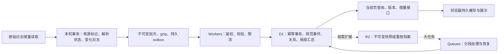

# 同步上行与云端查询：研究建议

日期：2026-09-11。状态：**候选方案，未批准修改产品实现**。本轮只研究、核对公开官方资料和阅读已有实验，未创建云资源、上传新数据、部署、提交或发布。

本文接续[需求记录](sync-rework-2026-09-11.md)、[算法方案](sync-pipeline-algorithms-2026-09-11.md)和[协议补充](sync-protocol-contract-2026-09-11.md)。需求记录中较新的用户决定优先；本研究不把旧候选自动变成已确认决定。

## 1. 推荐结论

**当前最适合本项目的起点是：本机增量采集与持久待发队列 → 压缩的跨会话增量批次 → Workers + D1 有界事务处理 → 云端按页查询 → 浏览器缓存已解析结果。** 普通增量直接提交可查询结果；R2 用于以后确实需要的长期重放档案、不可变快照或大导入；Queues 用于需要脱离客户端继续执行的重建任务；Durable Objects 暂不列为必需依赖。

这是一项结合现有证据、用户规模和维护成本的工程推荐，尚未实测证明所有候选中的绝对最优。100k 历史本身不足以要求上齐 R2、Queues、DO。应先消除重复工作与固定等待，再用同一真实输入比较必要的服务扩展。

最优先改变的不是 JSON 库或传输协议名称，而是这五件事：

1. 解析事务直接记录变化；新增几条事件只处理这些变化，避免同步层再扫描所有会话、重传整个会话修订。
2. 多个会话的变化放进同一个有界批次，gzip 低压缩级别编码；有积压就连续发送，少量并发配合服务端背压。
3. 云端一次应用只读写受影响的来源、规范事件、关系及汇总；避免整库 JSON、全局大索引反复读取和改写。
4. 上传完成响应与数据提交使用同一个幂等边界；通常一次响应就报告“已接收且已应用”。只有大任务才需要持久待处理状态。
5. 云页面与 API 优先同源。当前页直接查询云端已处理结果；浏览器按原刷新设置更新，后续全历史缓存独立推进。



采集器继续自主运行；云端和浏览器均不向机器下达读取、解析或补传指令。账号额度仍由在线采集端自主代读并上报，共享额度不相加；一个失败来源不能覆盖其他来源的有效结果。访问端首次近期、第二次全量、自动／手动共用进度等已确认逻辑保持适用。全量缓存的是已解析数据，不以保留原始待解析日志或独立离线引擎作为首屏前提。

## 2. 上传慢：哪些已经有证据

以下是不同阶段，不应把它们相加为一次产品上传总耗时。

| 证据 | 结果 | 能支持的判断 | 不能据此判断 |
| --- | --- | --- | --- |
| 仓库同步协议静态分析 | 17,106 事件、207 非空会话至少 242 次 chunk + 207 次 commit；每 tick 最多 4 次串行数据请求；至少 113 ticks、112 秒轮间等待 | 会话提交粒度和固定等待必然增加补传延迟 | 不是正在运行服务的上传计时；尚不含网络、config/status、空会话、重试 |
| v3 100k 实际上行 | 70,504,634 B 未压缩 JSON，200 请求、3 路并发，93.725 秒 | 大请求总字节和请求数都值得优化 | 不能直接认定用户带宽或某地网络有故障 |
| 同组 200 条匹配 invocation | 客户端每请求中位 1,347 ms；CF wall 211 ms；CPU 5 ms；D1 SQL 0.498 ms，2 次 D1 调用 | Worker CPU 不是这组 seed 上行的主要等待；SQL 时间远小于整个调用时间 | 客户端减 CF wall 不是纯 RTT；SQL 时间不包含完整 D1 远程往返 |
| 同数据本机压缩 | gzip level 1：4,286,945 B、83.772 ms；level 6：3,639,494 B、232.399 ms | gzip 1 是已有强证据支持的低成本起点 | 不能按压缩比例折算 93.725 秒 |
| v3 有界实网上行对照 | 同 5,000 条 payload：raw 3,413,470 B，4 次 7.635–9.304 秒；gzip 220,862 B，4 次 0.527–0.838 秒 | 本线路上压缩显著降低“收 body、解码、校验摘要”的时间 | 端点不写 D1、不做规范化／聚合，不是完整新协议的提速证明 |
| v1 压缩后的上传 | 10k 约 313 KB gzip，23 个串行批次仍需 A 19.027 / B 13.316 秒 | 仅压缩仍不足；请求往返与处理布局也重要 | v1 每请求另有预算表写入，不是平台固有成本 |
| v2 等价当前页 | A 已准备、空浏览器 0.362 秒；B 空浏览器 4.270 秒；缓存确认 0.369 / 0.339 秒 | 在线首屏适合从云端直接获取已处理页面 | 固定三页物化原型不证明任意筛选成本；数据抵达不等同 UI paint |
| 日期基数控制 | 相同 100k 数据，127 → 3,809 活跃日期；本机总阶段中位差约 1.54%，索引体积增约 15.09% | 日期维度增加存储及一些工作，但本次不是巨大解析差异来源 | 不能用它解释此前云端 OOM 或秒级传输差 |

来源：[上传诊断](../../experiments/parser-placement-realinput/upload-diagnostics.json)、[真实输入说明](../../experiments/parser-placement-realinput/README.md)、[实网上行对照](../../experiments/parser-placement-v3/results/transport-comparison.json)、[v1 报告](../../experiments/parser-placement/REPORT.md)、[v2 报告](../../experiments/parser-placement-v2/REPORT.md)。raw/gzip 对照为交替四轮，未当作独立网络环境或人群统计。

**采集器不能整体被描述为“每次都重读原始日志”。** `server/importer.ts` 已有文件状态判断、追加位置、冻结 EOF、完整行边界以及事件／解析状态／游标的同事务提交。明显重复的是 `server/usage-sync.ts:scan()`：读取所有 threads，再读取各自全部 effective_events、编码分片并算 hash；该扫描还有 60 秒门槛，采集进行中会跳过。正常新增记录即使早已本机解析完，仍可能等到下一次同步扫描。应把 importer 已提交的变化直接接进 outbox，保留现有增量能力。

代码入口：[增量导入](../../server/importer.ts)、[同步准备与调度](../../server/usage-sync.ts)、[200 条／256 KiB 限制](../../shared/usage-sync.ts)、[传输](../../server/cloud-sync.ts)。这些是工作区代码分析，未核对已安装服务是否运行同一版本。

v3 容量探测进一步说明物理布局的重要性：一次处理路径在 50k 时出现 41,497,368 B D1 RPC 序列化参数超出 32 MiB 的错误，100k 时真实 invocation 为 `exceededMemory`；后来分段路径能够发布 100k。32 MiB 在这里是明确捕获的运行时错误，不在本研究中提升为所有 D1 接口永远一致的上限。分段成功也不代表其当前批大小和全部查询代码已经最优。[v3 汇总](../../experiments/parser-placement-v3/results/summary.json)

## 3. 服务组合的选择

| 候选 | 日常小增量 | 历史补传／重建 | 可靠性与复杂度 | 本项目建议 |
| --- | --- | --- | --- | --- |
| Workers + D1 直接增量事务 | 一次 HTTP 通常可完成接收和应用；局部读、计算、事务写 | 按批持续应用，已应用部分可查，另报覆盖进度；整代重建需独立发布方案 | 服务较少；必须处理并发 CAS、幂等与事务大小 | **首选基线** |
| Workers → R2 不可变压缩批次 → D1 索引，按需 Queues | 增加对象持久化及后续读取／任务延迟；单条更新若单独建对象会放大操作数 | 适合独立重放、一次大导入、历史快照分发，计算与接收可分离 | 需解决 R2／D1／Queue 非原子、多阶段状态、孤儿对象和死信恢复 | 有明确重放／快照需求或直接路径不能满足积压目标时引入 |
| Workers + DO 协调 + D1 | 可串行化同用户竞争，减少乐观冲突，但多一次服务调用 | 有利于少量单用户任务协调，不消除 D1 单库吞吐上限 | 要维护 DO 生命周期、持久任务及 D1 双存储边界 | 暂缓；冲突率、重复调度实测成为主要成本后评估 |
| DO 内 SQLite 作为主要用户库 | 业务计算与存储靠近，能简化同步事务 | 每用户库自带位置与生命周期，仍需有界处理和快照 | 是主存储选型变更；不是在现有 D1 前加一个锁就能获得的全部收益 | 可作为将来架构专项对照，不与本次上行优化捆绑 |

D1 `batch()` 将多个 SQL 语句合成一个数据库调用并提供事务失败回滚；这可以减少远程等待，不能让整个单库平行执行。D1 单库串行处理，过多并发会排队并可能返回 overloaded；Paid 单库最多 10 GB，长期多用户增长应按实际物理容量和写入吞吐分库，不按“100k”这一事件数硬编码切换。[D1 batch](https://developers.cloudflare.com/d1/worker-api/d1-database/)、[D1 limits](https://developers.cloudflare.com/d1/platform/limits/)

R2 的优势是对象存储与重放，不是自动加速 SQL。R2 对象操作强一致，但它与 D1 的组合仍不是一个跨服务事务；使用缓存域名时还需考虑缓存陈旧性。[R2 consistency](https://developers.cloudflare.com/r2/reference/consistency/)

DO 适合需要同一实体状态协调的场景；它不会把外部 D1 写入自动纳入本地事务，也不能仅凭“单线程”忽略跨 `await` 的并发和失败边界。[Durable Objects 设计规则](https://developers.cloudflare.com/durable-objects/best-practices/rules-of-durable-objects/)

### 3.1 R2、Queues 和 DO 的实际引入条件

- **R2**：用户要求保留可独立重算的必要来源封装；结构化快照经常被多浏览器下载；或历史归档占 D1 大多数空间。普通 100k 事件长期存在 D1 并不构成必须引入 R2 的理由。若只保留已解析结果，不能宣称还能从云端重做所有旧原始日志解析。
- **Queues**：重建／压实必须在采集端和浏览器退出后继续；直接应用的 p95 不能达到已约定可见目标，且已排除糟糕批次、查询或全量重算。队列只带 job／对象引用，历史与实时任务隔离或保留实时容量；不让新事件排在整个历史导入后。
- **DO**：同账号来源竞争使 CAS 重算或调度冲突持续显著，例如大于 5% 是可测试的告警起点，不是已测阈值；在此之前用 D1 正确事务与低并发更容易维护。

## 4. 可评审的最小协议

### 4.1 身份、修订和顺序

```text
UploadBatch
  schema_version, parser_version, dataset_epoch
  collector_id, producer_epoch, lane, lane_seq
  batch_id, content_hash, decoded_bytes
  atomic_groups[]

AtomicGroup
  group_id
  operations[]

SourceOperation
  observation_id, source_id, source_generation, record_locator
  source_revision, operation = upsert | tombstone
  proposed_event_id, identity_evidence, origin_evidence
  session_id, turn_id, source_project_id, execution_device_id
  observed_payload

Ack
  batch_id, content_hash, accepted_groups[], applied_groups[]
  received_at, applied_commit_seq
  contiguous_received_seq, contiguous_applied_seq
  holes[], retry_after_ms, suggested_limits, config_version
```

租户／用户数据域由鉴权决定，不信任客户端 body 自报。UUID 用于身份，不用于授权。事件 identity 与上传者分离；换凭据、复制同一来源或换上传机器，不增加消耗。相同 observation 的修订只在同来源代次中比较，不能比较不同机器的计数器或用收到时间选真值。

`batch_id` 对应不可变内容；同 ID 同摘要返回既有结果，同 ID 不同摘要报冲突。普通独立变化可以共批，跨实体撤回／建立别名等必须共同生效的变化放在同一 AtomicGroup。初版优先让一个 transport batch 等于一个有界原子组；确有需要再支持多个组及逐组 ACK，避免不必要的部分确认复杂度。

`source_revision` 防止内容倒退，`lane_seq` 表示某采集端某通道的投递覆盖，`commit_seq` 是云端已发布规范变化的顺序；三者不可混用。较后批次先到时能安全应用独立新修订，但 ACK 的连续覆盖前缀不能跳过缺口。live／backfill 通道独立，旧历史缺口不能阻塞新的 live 批次。

### 4.2 本机持久流程

1. 文件 watcher 只作低延迟提示，仍周期性复核文件状态以兜底遗漏；按来源代次和完整行游标读取，保留 legacy 高水位、turn 上下文和 fork 继承排除逻辑。
2. 本机事务一起保存来源观察、受影响事件、必要上下文、变化日志／pending 与已消费游标。事务失败不前进游标；崩溃恢复后仍能从 durable outbox 续传。
3. 领取待发修订后在事务外编码／压缩，持久保存最终批次字节和摘要，再以所领取的修订为条件清除 pending。封装 r1 期间产生的 r2 继续待发，不能被按实体 ID 的无条件删除吞掉。
4. 同一实体尚未封装的多次修订可以合并为最新状态；已经发出的批次保持不变。恢复上次未确认批次，禁止每次重试生成新 ID。
5. ACK 丢失时重发原批次；只有云端已可靠接收才解除本机的传输保留。直接路径应等已应用；异步路径可按用户数据保留策略在“持久接收”后释放传输字节，但仍保留本机规范数据与待应用状态。

现有 importer 的增量游标是起点，先新增事务变化记录接出，无需把原始 Codex JSONL 改写成带 UUID 的文件。

### 4.3 批大小、压缩与调度

这些是下一原型的起始搜索范围，不是平台极限或最终最优值。

| 项目 | 起始建议 | 调整依据 |
| --- | --- | --- |
| live 合并窗口 | 250–750 ms，首批／紧急元数据可立即发；最长等待先设 1 秒 | 完整记录到云可查的 p50/p95；不能为攒满批次超过可见目标 |
| transport 目标 | 512 KiB 未压缩起步，对比 256 KiB、1 MiB、2 MiB；同时限制压缩字节、操作数和受影响状态 | 请求耗时、D1 往返、处理工作集；路径／会话字段长度不均，不能只数 200 条 |
| 应用事务 | 每次只处理有限变化；按 SQL 语句数、参数／中间结果字节和受影响实体数再限流 | transport 大小不等同 SQL 事务大小；若一组超限走分段代次发布，不能任意切开原子组 |
| 压缩 | gzip level 1；极小 payload 如低于 1–4 KiB 可直接发；记录压缩收益 | level 6、字典／tuple 或其他编码只在同真实数据端到端对照后采用 |
| 并发 | 初始最多 2 个在途批次，搜索 1／2／4；同一数据域应用端优先 1 个写入工作流 | 网络受限且云端有余量时增；CAS 冲突、overloaded、429、p95 上升时减半 |
| 历史公平性 | 一条 live 保留容量，历史按老化轮转；高负载时约 3:1 的 live／backfill 调度份额作为起点 | live 延迟与历史最老待发年龄；不能只按会话 ID 排队，也不能无限饿死历史 |
| 失败重试 | 指数退避加随机抖动，尊重 Retry-After；网络恢复主动唤醒 | 永久格式／冲突错误不循环猛发；认证撤销停止该绑定 |
| 无变化 | 不发 payload；低频状态心跳，配置版本附在正常 ACK；保留独立撤销检查 | 不每上传 4 个块额外 GET config + PUT status；鉴权仍由每个请求验证 |

持续有 backlog 时不人为每 4 个请求 sleep 1 秒；让响应完成直接释放下一批发送名额。执行器仍要限制 CPU／磁盘负担并让出事件循环，这与一秒固定网络停顿不同。

初期保留可读、有版本的 JSON，加 gzip 即可验证大部分收益。数据批内可用 session／project／model 字典减少重复长字符串；它是编码优化，不能改变 null、整数精度、身份和修订语义。使用 Node 异步 zlib 或有限编码工作线程，限制同时压缩数量；不要为几毫秒压缩开大量线程。[Node zlib](https://nodejs.org/api/zlib.html)

接收端同时限制压缩字节和解压后字节，校验 schema 与摘要后才应用；不一次性缓冲完整 100k 历史。线上用 `Content-Encoding: gzip` 与明确的协议协商，验证代理和运行时是否已做解码，防止重复解压。现有实验是应用自行解压的探测，不能自动推断产品 Content-Encoding 路径已验证。[HTTP Content-Encoding](https://www.rfc-editor.org/rfc/rfc9110.html#name-content-encoding)

### 4.4 云端接收、计算和事务

直接路径建议是一个有界工作循环：

1. 鉴权、流式限量解码、schema／摘要校验。
2. 按 batch receipt 快速识别重传。通过一组有界查询，读取该数据域写版本、受影响 observation／identity 候选、规范旧状态及相关汇总。
3. 在 Worker 用共享确定性业务内核选优，得到规范事件 before／after、别名／撤回、受影响汇总差和下行 ChangeSet。内存复杂度由变化及相关候选控制。
4. **一个 D1 `batch()` 事务**验证读版本未变，写来源头、规范状态、汇总、版本历史、ChangeSet、receipt 和连续 ACK 覆盖；最后推进写版本。失败整批回滚。
5. 响应 `accepted=true, applied=true` 与已发布版本。客户端断线发生在提交之后时，下次 receipt 查询／重传得到同一成功；发生在提交之前则没有半份统计。

**在 Worker 先读旧值、计算增量，再执行 `batch()`，仍然存在并发竞态。** 两个上传者可能读取同一个旧状态，各自加一份贡献。需要所有相关写入方共用事务内版本保护。低竞争个人数据可先用“每数据域 write_version + CAS”；write_version 覆盖来源选优与统计依赖，独立额度上报可以使用自己的版本域。

可评审的门闩示意（不是已实现迁移）：

```sql
-- apply_guard.checked 有 CHECK (checked = 1)。head 必须预先存在。
-- 本语句是同一个 db.batch 的第一项。
INSERT INTO apply_guard(tenant_id, batch_id, checked)
VALUES (?1, ?2, CASE WHEN
  COALESCE((SELECT write_version FROM sync_head WHERE tenant_id=?1), -1)=?3
  THEN 1 ELSE 0 END);

-- 后续：整组实体/汇总/changes/receipt 写入；write_version + 1；删除门闩。
-- 任一失败导致整个 batch 回滚。
```

CAS 失败必须明确导致整个 batch 中止，再重新读受影响状态并计算；不能仅做 `UPDATE ... WHERE version=?` 后不检查 0 行命中，因为后续语句可能继续错误提交。SQLite CHECK 可阻止不满足约束的插入；将其用作 D1 batch 前置门闩需通过真实 D1 并发故障测试验证，包括异常分类和整个事务回滚。[SQLite CHECK](https://www.sqlite.org/lang_createtable.html#check_constraints)、[D1 batch 事务](https://developers.cloudflare.com/d1/worker-api/d1-database/)

门闩、receipt 的唯一键均含租户，避免客户端自选 batch ID 干扰其他用户。初版先用较粗的每数据域 CAS，规则较易审计；其正确性依赖所有相关写入路径共用保护，并须通过上述故障测试。若实测冲突成为瓶颈，可改受影响实体版本门闩或引入每用户协调者；不得为了压低等待取消并发保护。全局写版本和下行 commit_seq 分开：仅补来源证据而规范结果不变时可推进内部写版本，无需伪造页面数据变化。

批量 SQL 使用有限组参数或 `json_each` 展开有界 JSON 参数，避免每个事件独立一次 D1 远程调用；每一条绑定字符串仍低于 D1 限额。JSON 批内 token 是十进制字符串，不能由 JSON 数值转换悄悄丢精度。不要通过拼接用户值构造 SQL。[D1 JSON 支持](https://developers.cloudflare.com/d1/sql-api/query-json/)

### 4.5 两阶段状态是语义，不强制增加两次请求

- `received`：内容已持久保存，服务重启后能恢复。
- `applied`：规范状态和对应下行变更已原子发布，可以按该版本查询。

普通小批次两者在一次事务、一次 ACK 中完成；不需要每会话额外 commit HTTP。对于分段导入／重建，允许 `202 received`，但必须有持久 job／inbox 和可独立继续的执行机制。`waitUntil()` 可以辅助执行，不是无限时长的可靠队列；官方说明其在返回响应／断线后延长执行时间有限。[Workers duration](https://developers.cloudflare.com/workers/platform/limits/#duration)

若增加 R2：先写租户内不可变对象，再事务写 D1 inbox／任务；ACK 在持久对象和任务都确认后返回。R2 成功而 D1 失败留下的孤儿通过同摘要重试补齐；定期按无引用且过宽限期清理。任务通知使用 D1 outbox／可复扫 pending jobs 补漏，不能假定 D1 写入与 Queue.send 原子。消费者只在 D1 应用事务成功后 ACK；重复消息命中 receipt。Queues 默认至少一次投递，消息仍需幂等。[Queues delivery](https://developers.cloudflare.com/queues/reference/delivery-guarantees/)

## 5. D1 物理布局与查询

下列是逻辑表职责，不要求第一版一次性创建全部表。

| 数据 | 建议布局与索引 | 避免的问题 |
| --- | --- | --- |
| 来源头 | `(tenant, observation_id)` 唯一；source generation、最高修订、payload hash、event identity 索引 | 同一观察重读、新旧修订、复制来源不可被算成新增消耗 |
| 规范事件 | `(tenant, event_id)` 主键；时间、session、source_project、execution_device、model 等查询列，payload 必要字段 | 整个历史塞单行 JSON；改一个事件重写整个分片 |
| 规范历史／删除 | `(tenant, entity_id, canonical_revision)`；valid_from／valid_to 或可恢复的变化历史 | 固定快照期间事件被修订后丢失旧版本；老快照复活 tombstone |
| 会话与轮次 | 独立实体；唯一 session_id；关系边另表 | 按项目路径把同 session 拆成两个统计对象；相加 distinct 数量 |
| 项目关系 | 原项目记录、合并边及证据、逻辑项目映射、关系版本 | 为合并项目重写全部事件；丢失来源和自动合并说明 |
| 汇总 | 日／session／必要固定维度的独立行，必要的 membership 引用计数 | 5–10 MB 全局索引每次增量整体解析／写回；无限组合维度物化 |
| 下行变化 | commit 头与有限 ChangeSet 内容／分块，scope 的 before/after | 任意项目或日期修订后旧范围没收到撤回；游标越过缺口 |
| receipt 与进度 | batch ID + hash、应用结果、producer/lane 连续水位与有限 holes | 超时重发重复加数；最高收到序号误当完整覆盖 |
| 快照清单 | generation、cut、schema、scope、块号、摘要、计数、完成状态 | 只更新一个“完成”标记但内容不是同一时点 |

索引按真实查询路径建设，起始关注 `(tenant, at, event_id)`、`(tenant, session_id, at, event_id)` 和高频项目／模型条件；不为所有列及所有组合创建索引。分页优先稳定排序键加唯一 ID 的 keyset，避免深 OFFSET 和同时间点翻页漏项。验证 `EXPLAIN QUERY PLAN` 与 D1 的 rows_read，而非只看返回 50 行。

**精确整数需要保留。** D1 API 的 BigInt 目前不受支持，内部 INTEGER 是有符号 64 位，但 JS Number 读取超出安全整数会有风险；SQLite `sum()` 还可能整数溢出或因浮点输入转为近似。初版 token／精确汇总可保留规范十进制 TEXT，由共享内核以 BigInt 更新受影响汇总；null 的缺失数单独维护。任意筛选若必须现场求和，分批读取命中数据以 BigInt 累加，后续再评估安全整数分肢聚合；禁止直接把精确 TEXT 转 REAL 求和。[D1 类型](https://developers.cloudflare.com/d1/worker-api/#type-conversion)、[SQLite sum](https://www.sqlite.org/lang_aggfunc.html#sumunc)

增量汇总采用“撤回 before、加入 after”。时间、模型、机器或项目修订时两侧范围一起失效；session／turn 的 distinct 由身份或引用计数维护，不能把每日 distinct 直接相加。最早／最晚时间被撤回时，使用该 session 的时间索引查询邻项，不重扫无关 session；跨时区和非整日筛选使用真实时间范围，不能把 UTC 日桶误当所有时区都精确可加。

同一 session 关联两个来源项目后合并整个逻辑项目及其全部会话，是已确认行为。逻辑项目映射变化不改变全局事件总量；合并理由、来源目录、关联 session 和人工／自动证据保留，供名称旁灰色圆圈感叹号的悬浮说明。用户随后已在需求记录 3.23 节确认：Git 项目按仓库，无 Git 的已保存项目按 App 项目身份／根目录，独立 Codex 对话按 thread/session；具体采集映射渠道仍待实现核验。组解除或证据修订需要重算受影响连通分量，不能只使用不支持删除的 union-find 而宣称可撤销。

当前页以有界索引查询和少量固定汇总组成；常用结果可设有容量上限的版本缓存。任意筛选由规范条件、排序、页游标及数据版本组成缓存键，限制每用户条目数和总字节。不为每个筛选／页数永久建立物化页面，也不让一个新浏览器重新构建云端共享状态。

## 6. 访问端：当前页、条件请求和完整历史

### 6.1 保留原刷新语义

页面先显示已缓存的上次版本，标明其新鲜度；按用户原自动间隔或手动动作查询云端当前页。首次近期范围和第二次全量历史的下载进度另存，两次触发共用状态；本研究不建议绕过该设置增加强制实时推送。

查询响应包含 `dataset_epoch`、`commit_seq`、`query_key`、schema／parser／价格／项目关系版本及覆盖信息。ETag 必须反映会影响该结果的版本；相同条件请求可返回 304，减少重复传输，但仍可能有鉴权、版本查询和网络往返。不能把 304 当“无需请求”。[HTTP If-None-Match](https://www.rfc-editor.org/rfc/rfc9110.html#name-if-none-match)

多表页面应在同一事务读边界取得数据及版本，防止总计和 session 列表来自不同提交。启用 D1 读副本时使用 Sessions／bookmark 维持顺序一致；上传后的读可带至少该提交的 bookmark 或走 primary。**bookmark 不是固定不变的快照**，不能拿它代替跨多个下载请求的一致性截面。[D1 Sessions](https://developers.cloudflare.com/d1/worker-api/d1-database/#withsession)、[读复制](https://developers.cloudflare.com/d1/best-practices/read-replication/)

### 6.2 CORS 往返

优先让云端 HTML 和 `/api` 处于同源：同一 Worker 托管或已有同源反向代理。可保留当前 Bearer 鉴权；消除 CORS 预检依靠同源拓扑，不必先改 cookie。原生 Node 采集器没有浏览器 CORS 限制，不应把浏览器 OPTIONS 当成上行采集器的固定成本。

必须跨域时，显式允许可信 origin、必要方法与 headers，设置合理 Max-Age；避免无意义随机 URL、重复握手和不必要自定义头。预检缓存包含 URL、origin、网络分区、凭据模式等，Max-Age 不能让不同分页 URL 共用一次预检，也不能保证浏览器永不提前驱逐缓存。[Fetch CORS-preflight cache](https://fetch.spec.whatwg.org/#cors-preflight-cache)

v3 有 Authorization 与 x-exp-request-id 头；20 个 `/input?part=N` 是不同 URL。其 Worker 已设 Max-Age=86400，browser-worker 的 request ID 在 header，不能把所有预检都归因于随机 rid URL。重复相同 URL 为什么仍出现预检，尚需 CUA 浏览器网络证据核查；不能凭静态代码声称已经定位。Header 值变化本身与新增 header 名称不是同一回事。

同源服务端 session cookie 可以减少 JS 暴露 bearer 的需要，但它是身份设计选项：采用 Secure、HttpOnly、适当 SameSite、短生命周期／撤销，写请求增加来源／CSRF 防护。cookie 不会自动消除跨域非简单请求预检，跨站 cookie 还有浏览器策略限制。禁止为提速关闭鉴权、把 token 放 URL、使用 `no-cors` 读取私有 JSON 或泛化允许任意 credentialed origin。[MDN CORS](https://developer.mozilla.org/en-US/docs/Web/HTTP/Guides/CORS)、[Set-Cookie](https://developer.mozilla.org/en-US/docs/Web/HTTP/Reference/Headers/Set-Cookie)

### 6.3 快照、增量和 GC

第一轮近期 scope 和活跃 session 集合固定于 cut C0；第二轮按计划补足全量已解析历史。分块并发下载、逐块校验和持久化，不在内存拼成一个巨型对象。增量 ChangeSet 与实体变更、tombstone、对应游标在同一个 IndexedDB 事务提交；已经完整覆盖的近期高版本数据可复用。

**仅筛选 `last_modified <= C0` 的当前事件表不能形成 C0 快照。** 如果事件在导出中途变成 C1，它的 C0 旧值已不在当前表，就会从快照漏掉。需要保留有效版本区间并按 C0 读，或预构建不可变检查点后从变更日志重放到 C0。首次采用版本历史加有界导出，后续不可变块可以存 D1 或按需 R2；清单仅在所有分块计数／摘要校验后发布。

客户端下载期间新变化用 commit_seq 续接。旧块不能覆盖较新的 canonical_revision；范围变化必须检查 before_scope 与 after_scope，实体离开筛选范围也应收到撤回。scope 变更或缺失分页不是“零事件”，应保留覆盖缺口。

删除 receipt／旧日志／来源 tombstone 前要同时满足：已有验证通过的可恢复快照、明确最早可用游标、无活动构建租约引用、足够恢复宽限期。过旧下行返回 RESET_REQUIRED，从快照重新建基线；过期上行批次不能当新批次重放。保留 source generation 的最高修订／退休记录，或要求退役来源走显式重登记和协调检查。不能为了 GC 删光防重放信息，再让旧副本恢复已撤回事件。

大范围解析升级／身份修复采用新 generation 分段构建，校验后追上明确水位，再原子切换 active generation；切换前旧代仍可读。验证构建期间并发新写如何进入新代、如何续接游标，以及浏览器不混读两代。原始文件从本机清理不自动生成历史消耗删除。

## 7. 成本模型与规模边界

按 2026-09-11 查阅的官方页面，Workers Paid 含 1,000 万请求、3,000 万 CPU ms／月，超额分别 $0.30／百万请求、$0.02／百万 CPU ms；固定最低 $5／月。用户已表示有 Paid，这笔固定费不应再次算作本方案新增，但账户包含额度剩余量未知。[Workers pricing](https://developers.cloudflare.com/workers/platform/pricing/)

D1 Paid 含 250 亿读行、5,000 万写行／月和总计 5 GB，超额分别 $0.001／百万读行、$1／百万写行、$0.75／GB·月。行读是扫描行数，索引也增加写入和空间；打包一行 JSON 可以减少账面行数，却可能增加重写字节和计算，不能只按写行最少选结构。[D1 pricing](https://developers.cloudflare.com/d1/platform/pricing/)

设一个月动态 Worker 请求数 Q（含实际 OPTIONS、心跳、重试和消费者），CPU 毫秒 C，D1 读行 R、写行 W、存储 GB·月 S。各产品计费按账户汇总，带入相应剩余额度计算；若只估计“相关包含额度全用完”的名义超额单价暴露：

```text
Worker 与 D1 名义增量 =
  0.30 × Q / 1e6 + 0.02 × C / 1e6
  + 0.001 × R / 1e6 + 1.00 × W / 1e6 + 0.75 × S

W 应拆为 observation、canonical、历史版本、聚合、关系、receipt、GC、索引的实际 meta 合计。
S 应用真实 DB size 与每日保留量，不能拿 JSON 字节直接当 SQLite 物理大小。
```

一个用于比较方案的假设场景：保留 100k 历史、月内 10k 新事件及少量修订／副本，3 个访问浏览器，约 6,100 动态请求，120,000 CPU ms，6,000,000 读行，200,000 写行，0.25 GB·月 D1。按上述单价合计 $0.39773／月；若每请求一条计费日志且日志额度也用完，另约 $0.00366。**输入全是假设系数，不是新协议实测，也不是账单。** 额度足够时这些用量可能完全被覆盖；不能据此承诺所有用户永久免费。各系数要由下一原型实测替换。

R2 Standard 为 $0.015／GB·月、Class A $4.50／百万、Class B $0.36／百万，含 10 GB·月、100 万 A、1,000 万 B；出口不收费。官方还说明超出包含量后的计费单位向上取整，因此少量对象的线性微美元推算不能当实际账单。保存 100k 单事件对象会有 100k PUT，若按约 1k 事件的不可变包则约 100 PUT，实际还须计 HEAD／GET／清单／压实操作。[R2 pricing](https://developers.cloudflare.com/r2/pricing/)

Queues Paid 含每月 100 万操作，超额 $0.40／百万；正常小消息一次投递通常含写、读、删三个操作，重试另增，按每 64 KB 计数。使用小引用消息后，N 个成功工作单元的基础队列量约 3N，另加失败重试与死信操作；消费者 Worker／D1／R2 成本仍分别计算。队列保留不是永久历史存储，Paid 默认 4 天、可配置到 14 天。[Queues pricing](https://developers.cloudflare.com/queues/platform/pricing/)

对单用户 100k 到更多历史，优先关注“每月新增及修订量”“每次影响多少状态”“平均每批多少请求”“索引物理空间”，而不是仅看历史事件数。D1 和 Worker CPU 仍可能成为容量边界，但 128 MB 是每 isolate 共享，不是每请求独享；并发请求工作集也要合计。按 256 KiB–2 MiB 级有界批次设计，不能因为 HTTP 接收允许更大 body 就一次解压整库。[Workers limits](https://developers.cloudflare.com/workers/platform/limits/)

## 8. 分阶段验证与将来实施

### 8.1 下一次原型应回答的最少问题

本研究没有启动新实云实验。下面的矩阵是可执行候选，启动前沿用本任务对实验的具体授权和资源预算，不当作产品实施批准。

| 实验 | 固定项与对照 | 通过条件／指标 |
| --- | --- | --- |
| 本机发现到 outbox | 真实 17k 基线、100k 扩展；短会话与最长会话分别追加 1／45 条；仅修订、截断重解析 | offset／语义精确；日常成本随变化量而不是全历史量增长；记录读取、解析、reconcile、编码分别耗时 |
| 压缩完整上传 | 同一 canonical 输入；gzip 1／6，256 KiB／512 KiB／1 MiB／2 MiB；并发 1／2／4 | 统计精确一致；wire bytes、HTTP 数、D1 calls、CPU、wall、排队、applied 延迟，交替多轮 |
| 长历史混合实时 | 持续历史积压时每秒加入少量新事件，加入一个长 session 的修订 | live p95 达到已讨论目标且 backfill 最老年龄持续下降；不是平均数掩盖饥饿 |
| 同时复制与修订 | 两采集端相同事件、副本、乱序 r1/r2、冲突同 ID 不同 hash | 全局只计一次，执行设备不跟随上传设备变化；冲突可见，重复 ACK 不重复写 |
| D1 事务竞态 | 两请求读同 write_version，控制先后提交；首句／中间／最后失败；提交成功后丢 ACK | CAS 失败全回滚；receipt、状态、汇总、游标一致；不靠测试顺序避开竞态 |
| 新代重建 | 构建中 live 继续写、重启执行器、重放同段、切换时读取 | 旧代持续可查，新代完整且追上水位；没有半发布或跨代混页 |
| 浏览器在线首屏 | 空缓存／warm／版本更新；同源与跨域；当前页和真实任意筛选、下一页 | CUA 验证数据到达、DOM 与绘制分开；记录 OPTIONS；当前页不等 100k 全量下载 |
| 浏览器两轮缓存 | 第一次近期，第二次全量；更老实体移入／移出范围、tombstone、IDB 中断、过期游标 | 覆盖范围准确；旧块不覆盖新值；完整后总量等于云端同 cut oracle |
| 数值与关系 | >2^53、累加超 2^63、null、fork、同 session 多来源项目及传递合并 | 精确整数与缺失数；全局、机器、项目及 session 口径一致 |
| 成本与边界 | 同一 payload 去掉实验性逐请求 DB 预算写；完整计 Worker／D1／对象／队列量 | 报告实际与估算分开；每种布局的请求、读写、物理存储及 CPU 可复算 |

原始 JSONL 的完整读取与 legacy 语义解析必须另设小规模真实 fixture 验收。现在 17k／100k 真实衍生输入来自已解析 cache，其中 legacy 累计转增量已在本机完成，不能用当前实云数据证明旧格式端到端迁移已经正确。

时间日志应至少包含 `record_complete → local_commit → batch_ready → send_start → server_received → applied → next_user_refresh → page_data → DOM`；不同机器时钟不能直接相减，阶段内用各自单调时钟，端到端用受控客户端观测／关联 ID。记录请求 body 字节、响应字节、D1 SQL 与完整往返，先排除真实网络分量后再谈线路优化。

### 8.2 用户批准之后的产品落地顺序

1. 补阶段可观测性及 importer → durable change log，保留当前统计口径；本机影子核对新旧输出。
2. 加协议新版本、幂等 receipt、跨会话批次、gzip、连续调度和有界并发；旧设备协议在迁移期明确保留。
3. 完成云端来源／规范事件局部事务、CAS、细粒度汇总和正确下行变化；通过故障测试后切换新通道。
4. 当前页云查询、同源和条件响应，接入原刷新设置；两轮缓存和一致性快照继续使用明确版本与覆盖状态。
5. 只有矩阵显示需要时再加入 R2／Queues；额度选优、项目合并和解析版本迁移均纳入回归，不能因主链路变快而丢掉。

以上均是未来实施顺序。本轮没有修改产品代码、部署或改变已有云资源。

## 9. 仍需明确或实测的决策

- 最低支持的浏览器缓存范围、空间预算和过期恢复保留期；保留“近期／第二次全量已解析历史”的已确认语义。
- 云端是否需要独立重放必要来源封装，以及保留多久；它决定 R2 是否一开始就有明确用途。
- 最终批大小、并发、合并窗口和生产 p95 目标，必须以完整新协议测试决定。当前原型某个 500／5,000 数值不是天然最优。
- 源格式解释与跨来源规范化的最终分工；共享语义内核与 parser_version 必须固定，不能把已解析 cache 的实验当原始日志迁移证明。
- 项目组织方向已由需求记录 3.23 节确认；App 项目映射的采集渠道、历史缺失归属与仓库边界的具体识别仍需实现核验。同 session 导致整个项目自动合并及灰色说明图标继续有效。
- 账号额度采集器自主读取间隔、同账号结果新鲜度规则和来源失败状态保持原独立讨论，不由上传吞吐实验代替决定。

本研究建议先批准清楚的数据与事务契约，再决定产品实施；不需要用户对每个批量参数逐项选值。参数可在已批准边界内通过有界原型收敛。
